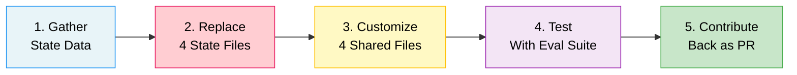
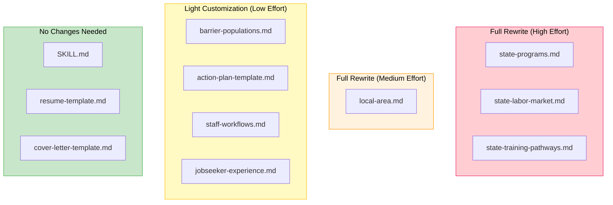

# Deploying Access to Jobs to a New State

This guide walks you through deploying the Access to Jobs workforce navigator to any U.S. state. The skill is designed with a modular architecture: universal modules work everywhere, while state-specific reference files are swapped per deployment.

---

## Overview

### Deployment Pipeline



### File Effort Map



| File | Action | Effort |
|---|---|---|
| `SKILL.md` | No changes needed | — |
| `references/state-programs.md` | **Full rewrite** | High |
| `references/state-labor-market.md` | **Full rewrite** | High |
| `references/state-training-pathways.md` | **Full rewrite** | High |
| `references/local-area.md` | **Full rewrite** | Medium |
| `references/barrier-populations.md` | Light customization | Low |
| `references/action-plan-template.md` | Light customization | Low |
| `references/staff-workflows.md` | Light customization | Low |
| `references/jobseeker-experience.md` | Light customization | Low |
| `references/resume-template.md` | No changes needed | — |
| `references/cover-letter-template.md` | No changes needed | — |

---

## Step 1: Gather State Data

You will need:

1. **Your state's WIOA Combined State Plan** (or Unified State Plan)
   - Source: Your state workforce agency website, or search `[State] WIOA Combined State Plan` on Google
   - DOL also maintains plans at: https://wioaplans.ed.gov/
   - Key sections: Title I programs, Title II (AEL), Title IV (VR), partner programs, performance data

2. **Labor market intelligence**
   - Your state's LMI agency (equivalent of Missouri's MERIC)
   - BLS Occupational Employment and Wage Statistics for your state
   - Lightcast or Burning Glass for job posting volume (if available)

3. **Training provider information**
   - WIOA Eligible Training Provider List (ETPL) — available from your state workforce agency
   - Community college and technical school program catalogs
   - Registered Apprenticeship programs in your state

4. **Local workforce development area details**
   - LWDA name, region, and boundaries
   - Job Center / American Job Center address and contact
   - Key local employers by sector
   - Local training providers

---

## Step 2: Replace State-Specific Files

### `references/state-programs.md`

Use the Missouri file as a template. Replace all program names, eligibility criteria, and access points with your state's equivalents.

**Required sections:**
- Core WIOA Programs (Title I: Adult, Dislocated Worker, Youth)
- Adult Education and Literacy (Title II)
- Vocational Rehabilitation (Title IV)
- SNAP Employment & Training (your state's brand name)
- TANF work program (your state's brand name)
- Veterans services (JVSG, state-specific programs)
- Trade Adjustment Assistance
- Unemployment Insurance (your state's UI system)
- Specialty populations and programs
- Supportive services available
- Key system access points (URLs, portals)
- Performance benchmarks (if available)

**Tip:** Search your state plan PDF for these section headers. Most states organize their plans similarly because DOL requires the same content.

### `references/state-labor-market.md`

Replace all occupation lists, employment data, and regional snapshots.

**Required sections:**
- Job tier framework (NOW/NEXT/LATER — adapt to your state's classification if different)
- Statewide employment overview
- High-demand NOW occupations (top 10)
- High-demand NEXT occupations (top 10–15)
- High-demand LATER occupations (top 5–7)
- Top industries by employment
- Regional snapshot (your state's workforce regions)
- Employer needs and skill gaps
- Registered Apprenticeship pathways
- Where job seekers find jobs (state job board, major portals)

### `references/state-training-pathways.md`

Replace all funding sources, training providers, and credential pathways.

**Required sections:**
- Decision logic (same framework works everywhere)
- Pathway by job tier (NOW/NEXT/LATER)
- Funding sources — detailed (WIOA ITA, state scholarship programs, SNAP E&T, VR, OJT, apprenticeship)
- Special populations — training notes
- Stackable credential progressions (healthcare, IT, construction, manufacturing)
- Key institutions
- How to access training (step-by-step)

### `references/local-area.md`

Replace with your target local workforce development area.

**Required sections:**
- LWDA status and WIOA region assignment
- Job Center / American Job Center location and contact
- Economic profile (employment, unemployment, key industries)
- Key local employers by sector
- Local training providers
- Rapid Response protocol (for mass layoffs)
- Veteran-specific programs (state OJT programs)
- Incumbent Worker Training status
- Active WIOA waivers
- UI claimant protocol

---

## Step 3: Light Customization

These files work mostly as-is but need location-specific references updated.

### `references/action-plan-template.md`
- Replace `jobs.mo.gov` with your state's job board URL
- Replace Missouri Job Center references with your state's American Job Center brand
- Update Day 1 resource checklist with state-specific URLs
- Update regional note if applicable

### `references/barrier-populations.md`
- Update state-specific statistics (veteran population, disability rates, etc.)
- Update program names (e.g., Missouri's "SkillUP" → your state's SNAP E&T brand)
- Update DOC/reentry program names and statistics
- Update youth program names (JAG availability varies by state)

### `references/staff-workflows.md`
- Update agency names in referral letter template
- Update employer outreach scripts with local program names
- Update case management system name (Missouri uses "MoJobs")
- Update performance tracking benchmarks

### `references/jobseeker-experience.md`
- Update wage data in Module 18 (minimum wage, living wage estimates)
- Update employer examples in Module 16 (LinkedIn section)
- Update career exploration portal URLs

---

## Step 4: Test

1. Upload the modified skill to Claude.ai
2. Run these test prompts and verify correct routing and content:

```
"I just got laid off, what should I do?"
→ Should route to Module 0 (Eligibility) with state-specific programs

"Write me a resume for a CNA position"
→ Should produce ATS-optimized resume with state credential references

"Am I eligible for job training?"
→ Should route to Module 0 with state funding programs

"I'm a veteran looking for work"
→ Should flag priority of service and veteran-specific programs

"I'm a case manager. Help me write case notes."
→ Should detect staff mode and route to Module 11
```

3. Verify that state-specific program names, URLs, and statistics appear correctly
4. Verify that universal modules (resume, cover letter, interview prep) still work

---

## Step 5: Contribute Back

If you deploy to a new state, consider contributing your state files back to the repository:

1. Create a branch: `state/[state-abbreviation]` (e.g., `state/il`)
2. Add your state files to a `states/[abbreviation]/` directory
3. Submit a PR with the state name and data sources cited

Over time, we aim to build a library of state-specific implementations that any workforce organization can deploy.

---

## Questions?

- **Email:** dougdevitre@gmail.com
- **GitHub Issues:** [cotrackpro/access-to-jobs/issues](https://github.com/cotrackpro/access-to-jobs/issues)
