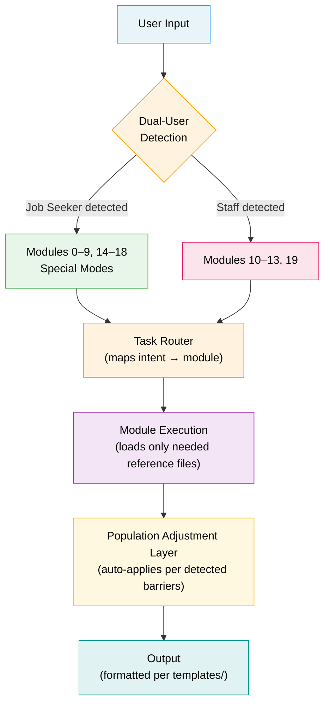
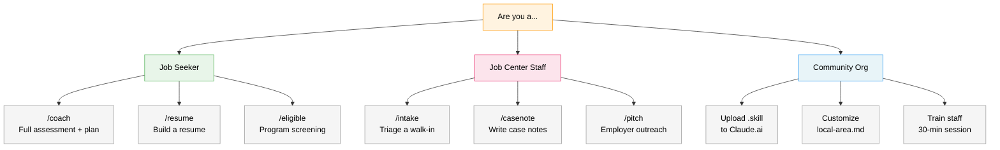
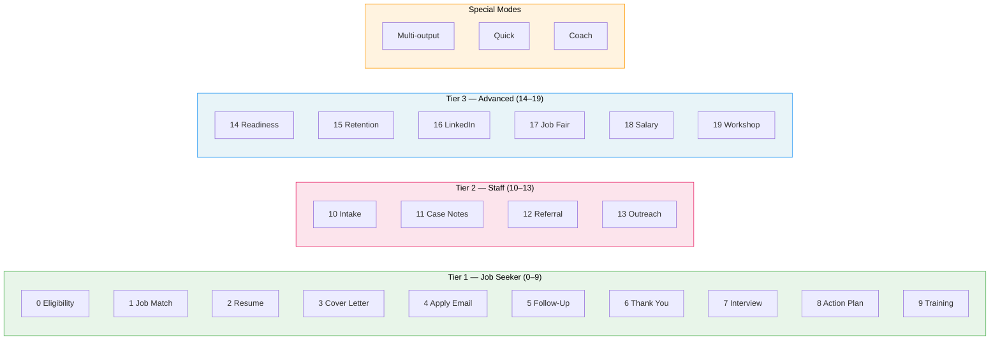
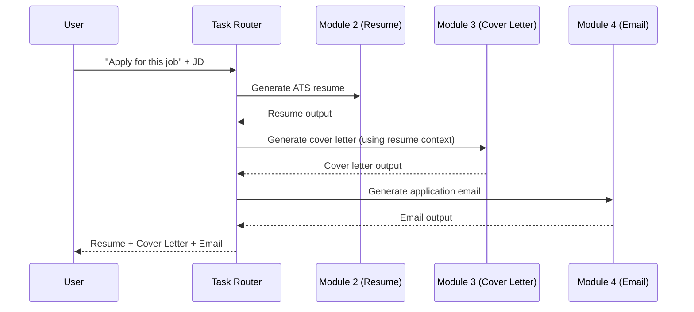
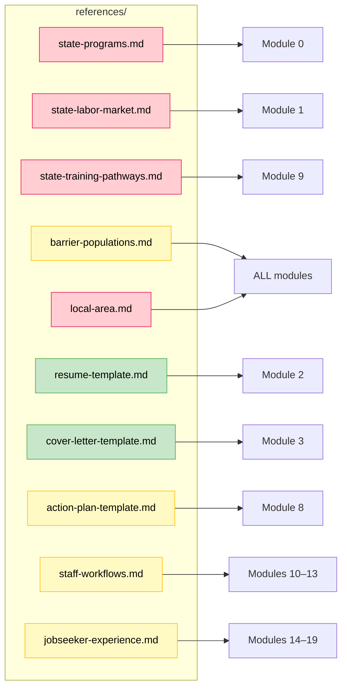
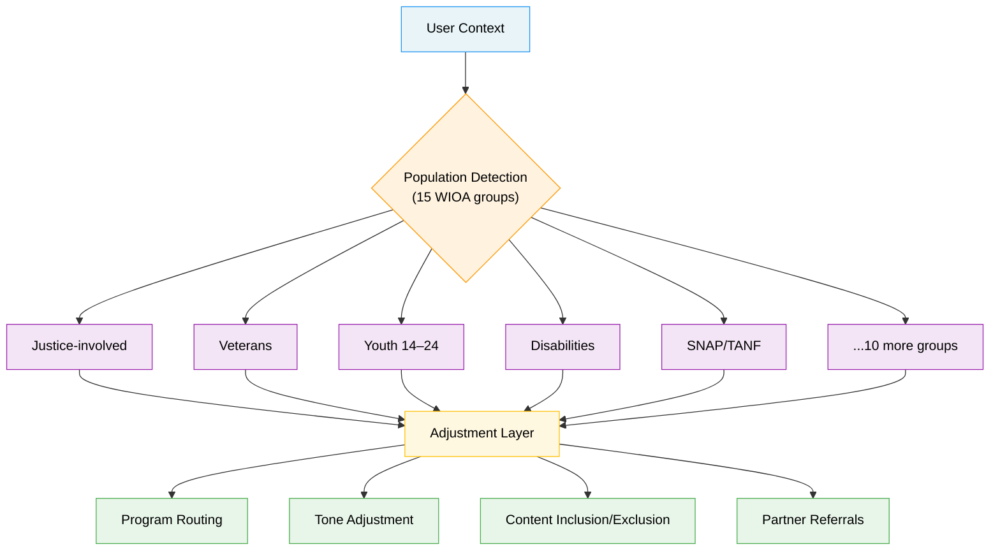
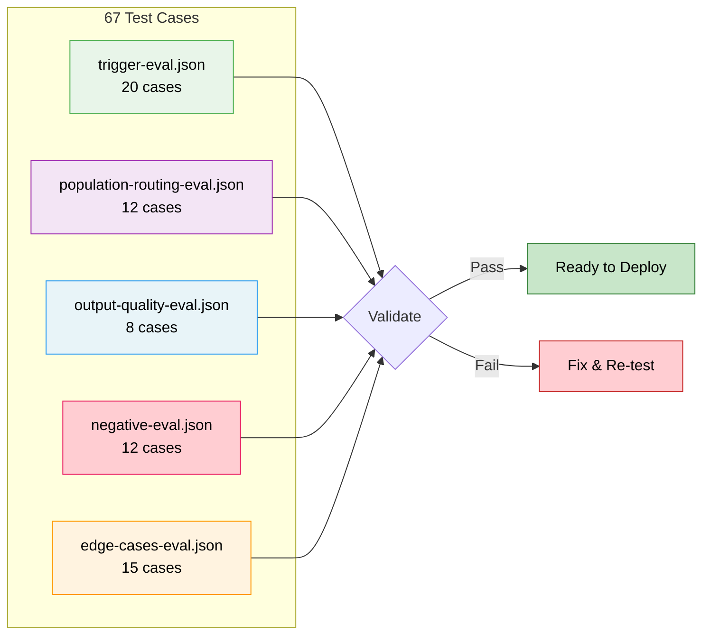
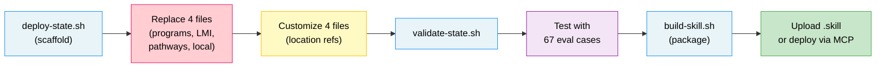

# Access to Jobs

**AI-powered Workforce Navigator** — open-source, state-deployable workforce development skill for Claude AI.

Part of the **[Access To](https://github.com/cotrackpro)** open-source civic tech initiative by [CoTrackPro](https://cotrackpro.com).

[](LICENSE)
[](CHANGELOG.md)
[](states/missouri/)
[](assets/module-map.md)
[](references/barrier-populations.md)

---

## Table of Contents

- [What It Does](#what-it-does)
- [Who It Serves](#who-it-serves)
- [Architecture](#architecture)
- [Directory Structure](#directory-structure)
- [Installation](#installation)
- [Module Reference](#module-reference)
- [Slash Commands](#slash-commands)
- [Population-Aware Routing](#population-aware-routing)
- [Templates and Output Formats](#templates-and-output-formats)
- [Data Schemas](#data-schemas)
- [Guides](#guides)
- [Evaluation Suite](#evaluation-suite)
- [Deploying to a New State](#deploying-to-a-new-state)
- [Access To Family](#access-to-family)
- [Data Sources](#data-sources)
- [Contributing](#contributing)
- [License](#license)
- [Author](#author)

---

## What It Does

Access to Jobs is a Claude AI skill that provides a comprehensive workforce navigator for **job seekers** and **Job Center staff**. It is grounded in the federal WIOA (Workforce Innovation and Opportunity Act) framework and ships with a full **Missouri** reference implementation covering all 114 counties.

### For Job Seekers (Modules 0–9, 14–18)

| Capability | What It Produces |
|---|---|
| Program eligibility screening | Routes to WIOA, SNAP E&T, vocational rehabilitation, veteran services, youth programs, and 20+ partner programs |
| Job matching | Top 5 roles classified NOW/NEXT/LATER with demand data and skills gap analysis |
| Resume generation | ATS-optimized, tailored to specific job descriptions, never fabricated |
| Cover letters | 3–4 paragraph format with professional/confident/friendly tone variants |
| Application, follow-up, and thank-you emails | Professional templates under 150 words |
| Interview prep | 5 role-specific questions with STAR-format answer coaching |
| 7-day action plans | Daily tasks calibrated to HIGH/MEDIUM/LOW urgency with application tracker |
| Training pathways | Shortest credentialing path with funding source matching (ITA, Fast Track, SkillUP, VR, apprenticeship) |
| Employment readiness assessment | 7-dimension scorecard with top 3 gaps and single next action |
| Job retention (30/60/90-day plan) | Structured first-90-days guidance for new hires |
| LinkedIn profile builder | Headline, summary, experience sections, connections strategy |
| Job fair prep kit | Before/during/after checklist with elevator pitch template |
| Salary negotiation | Market wage data, 5-step negotiation framework, WOTC awareness |

### For Job Center Staff (Modules 10–13, 19)

| Capability | What It Produces |
|---|---|
| Intake and triage scripts | Structured assessment with priority screening decision tree |
| Case notes generator | Compliant, professional notes compatible with case management systems |
| Referral letter drafts | Formal letters to VR, AEL, DSS, reentry, community partners |
| Employer outreach scripts | Cold call scripts for OJT, IWT, WOTC, Federal Bonding, apprenticeship |
| Workshop facilitator guides | Turnkey scripts for resume, interview, job search, LinkedIn, and financial literacy workshops |

### Special Modes

| Mode | Trigger | Output |
|---|---|---|
| **Multi-output** | "Apply for this job" | Resume + cover letter + application email in one pass |
| **Quick** | "Quick apply" | 3-bullet summary + cover note + short email |
| **Coach** | "Where do I start?" | Readiness assessment, top gaps, today's action, 7-day plan |

---

## Who It Serves

### Direct Users
- **Job seekers** — unemployed, underemployed, career changers, new entrants
- **Job Center staff** — career advisors, case managers, business services reps
- **Community organizations** — nonprofits, libraries, faith-based, reentry, shelters

### Barrier Populations (15 WIOA-defined groups)
The skill automatically detects and adjusts for:

| Population | Key Adjustment |
|---|---|
| Justice-involved / reentry | No conviction disclosure; DOC credentials; Fair Chance employers; Federal Bonding |
| Veterans and military spouses | Priority of service; MOS translation; DVOP/CODL; state OJT programs |
| Youth (14–24) | Lighter formality; youth-specific programs (JAG, Futures, Excel Center) |
| Individuals with disabilities | VR referral; benefits counseling; customized/supported employment |
| SNAP/TANF recipients | SNAP E&T; childcare/transportation supports; DSS coordination |
| No high school diploma | Adult Education first; IET model; Excel Center |
| English language learners | Plain language; AEL ELL; IET concurrent model |
| Homeless / housing insecure | Job Center physical access; wraparound services; realistic action steps |
| Older workers (55+) | Resume modernization; SCSEP; experience-as-asset framing |
| Displaced homemakers | WIOA priority tier; skills translation from home management |
| Single parents | Childcare support flagging; flexible schedule targeting |
| Long-term unemployed | Coach mode; small first steps; normalize difficulty |
| Foster care youth | Futures Program; wrap-around services |
| Low-income individuals | WIOA Adult priority tier; co-enrollment maximization |
| UI claimants | RESEA awareness; Coursera access; work search compliance |

---

## Architecture



### Getting Started Journey



### Module Tiers



### Multi-Output Mode (Sequence)



### Data Flow: Reference Files to Modules



### Population-Aware Routing



### Evaluation Pipeline



### State Deployment Flow



### Design Principles
- **Progressive disclosure** — collect only what the active module requires
- **Progressive loading** — reference files loaded on demand, not all at once
- **Dual-user detection** — auto-detects job seeker vs. staff from language signals
- **Population-aware** — adjusts tone, content, and routing per barrier population
- **State-deployable** — replace 4 files to deploy to any U.S. state
- **Trauma-informed** — calm, professional, empathetic throughout

---

## Directory Structure

```
access-to-jobs/
│
├── SKILL.md                          Main entry point — task router, module
│                                     definitions, guardrails, output defaults
│
├── README.md                         This file
├── LICENSE                           MIT
├── CONTRIBUTING.md                   Contribution guidelines + content standards
├── DEPLOYMENT.md                     Step-by-step state deployment guide
├── CHANGELOG.md                      Version history (v1.0 → v4.0)
├── .gitignore
│
├── references/                       CORE KNOWLEDGE (loaded by modules)
│   ├── state-programs.md             ★ WIOA + partner programs (Module 0)
│   ├── state-labor-market.md         ★ Occupations, demand, wages (Module 1)
│   ├── state-training-pathways.md    ★ Credentials, funding, paths (Module 9)
│   ├── local-area.md                 ★ Local employers, Job Center, providers
│   ├── barrier-populations.md        ◐ Population guidance (all modules)
│   ├── resume-template.md            ○ ATS rules, template, action verbs
│   ├── cover-letter-template.md      ○ Structure, tone variants, template
│   ├── action-plan-template.md       ◐ 7-day scaffold, urgency tiers
│   ├── staff-workflows.md            ◐ Intake, case notes, referrals, outreach
│   └── jobseeker-experience.md       ◐ Readiness, retention, LinkedIn, salary
│
├── templates/                        OUTPUT FORMATS + READY-TO-USE CONTENT
│   ├── output-templates.md           Every module's exact output structure
│   ├── email-templates.md            12 extended email templates
│   └── workshop-templates.md         5 full workshop scripts with agendas
│
├── schemas/                          JSON DATA SCHEMAS
│   ├── jobseeker-intake.json         Progressive intake data model
│   ├── application-tracker.json      Application tracking + status workflow
│   ├── case-note.json                Staff case note (MoJobs-compatible)
│   └── population-routing.json       Population → program → adjustment map
│
├── assets/                           REFERENCE MATERIALS + KNOWLEDGE ASSETS
│   ├── module-map.md                 Architecture diagram + module quick ref
│   ├── prompt-library.md             50+ curated prompts by audience
│   ├── data-sources.md               Full citation table + refresh schedule
│   └── glossary.md                   55+ WIOA/workforce acronyms defined
│
├── slash-commands/                   QUICK-TRIGGER COMMANDS
│   └── commands.md                   22 commands with usage examples
│
├── guides/                           AUDIENCE-SPECIFIC GUIDES
│   ├── community-org-guide.md        For nonprofits, libraries, shelters
│   ├── staff-onboarding.md           30-min training plan + cheat sheet
│   ├── quick-start.md                One-page guide for job seekers
│   └── guia-rapida-es.md             Guía rápida en español
│
├── evals/                            EVALUATION + TESTING
│   ├── trigger-eval.json             20 skill triggering test cases
│   ├── population-routing-eval.json  12 multi-population edge cases
│   ├── output-quality-eval.json      8 output quality checklists
│   ├── negative-eval.json            12 should-NOT-trigger test cases
│   └── edge-cases-eval.json          15 ambiguous/boundary scenarios
│
├── states/                           STATE IMPLEMENTATIONS
│   └── missouri/                     Reference implementation (default)
│       ├── README.md                 Missouri docs + program crosswalk
│       └── references/               Missouri WIOA State Plan data
│           ├── state-programs.md
│           ├── state-labor-market.md
│           ├── state-training-pathways.md
│           └── local-area.md
│
└── scripts/                          AUTOMATION + DEPLOYMENT
    ├── deploy-state.sh               Scaffolds new state with TODO templates
    ├── validate-state.sh             Validates state deployment completeness
    └── build-skill.sh                Packages repo into .skill for upload
```

**Legend:** ★ = Replace per state | ◐ = Light customization | ○ = Universal (no changes)

---

## Installation

### Claude.ai (Skill Upload)
1. Download the `.skill` file from [Releases](https://github.com/cotrackpro/access-to-jobs/releases)
2. Go to Claude.ai → Settings → Skills
3. Upload the `.skill` file
4. Start chatting — the skill activates on any employment-related request

### Claude Code / MCP
1. Clone: `git clone https://github.com/cotrackpro/access-to-jobs.git`
2. Point your skill path to the `access-to-jobs/` directory

---

## Module Reference

Full visual architecture: [`assets/module-map.md`](assets/module-map.md)

### Core Modules (0–9)

| # | Module | Minimum Input | Output |
|---|---|---|---|
| 0 | Eligibility Screener | situation | Program routing + next steps |
| 1 | Job Matcher | skills[], location, experience | Top 5 roles (NOW/NEXT/LATER) |
| 2 | Resume Builder | name, skills[], experience, JD | ATS-optimized resume |
| 3 | Cover Letter | name, target job, JD | 3–4 paragraph letter |
| 4 | Application Email | target job | Submit email (<150 words) |
| 5 | Follow-Up Email | target job, date applied | Follow-up (<100 words) |
| 6 | Thank You Email | interviewer name(s) | Thank you (<150 words) |
| 7 | Interview Prep | target job title | 5 Qs + STAR answers + tips |
| 8 | Action Plan | target job, urgency | 7-day plan + application log |
| 9 | Training Pathways | current skills, target role | Shortest path + funding |

### Staff Modules (10–13)

| # | Module | Input | Output |
|---|---|---|---|
| 10 | Intake and Triage | walk-in participant | Structured assessment + routing |
| 11 | Case Notes | service summary | Compliant case note |
| 12 | Referral Letter | participant, agency, reason | Formal referral letter |
| 13 | Employer Outreach | program to pitch | Cold call / pitch script |

### Advanced Modules (14–19)

| # | Module | Input | Output |
|---|---|---|---|
| 14 | Readiness Assessment | target job, situation | 7-dimension scorecard |
| 15 | Job Retention | job title, industry | 30/60/90-day plan |
| 16 | LinkedIn Builder | experience, target role | Full profile content |
| 17 | Job Fair Prep | event, target employers | Before/during/after kit |
| 18 | Salary Guidance | role, location, offer | Market data + negotiation |
| 19 | Workshop Guide | workshop type | Full facilitation script |

---

## Slash Commands

22 quick-trigger commands. Full reference: [`slash-commands/commands.md`](slash-commands/commands.md)

**Job Seeker:** `/eligible` `/match` `/resume` `/cover` `/apply` `/quick` `/followup` `/thankyou` `/interview` `/plan` `/train` `/ready` `/hired` `/linkedin` `/fair` `/salary` `/coach`

**Staff:** `/intake` `/casenote` `/refer` `/pitch` `/workshop`

**Utility:** `/glossary` `/programs` `/local` `/track` `/help`

---

## Population-Aware Routing

The skill detects barrier populations from context and automatically adjusts program routing, tone, content inclusion/exclusion, and partner agency referrals.

Full population guidance: [`references/barrier-populations.md`](references/barrier-populations.md)
Routing schema: [`schemas/population-routing.json`](schemas/population-routing.json)
Population routing matrix: [`assets/module-map.md`](assets/module-map.md) (bottom section)

---

## Templates and Output Formats

All in [`templates/`](templates/):

| File | Contents |
|---|---|
| `output-templates.md` | Exact output format for every module: resume, cover letter, all email types, interview prep, readiness assessment, case note, referral letter, application tracker CSV, LinkedIn headline formulas |
| `email-templates.md` | 12 extended templates beyond core modules: warm/cold networking, informational interview, post-networking follow-up, job fair follow-up, offer acceptance, offer decline, reference request, staff appointment reminder, employer introduction, partner coordination |
| `workshop-templates.md` | 5 complete facilitation scripts: Resume in 60 Minutes, Interview Skills (90 min), Job Search Fundamentals (45 min), LinkedIn for Job Seekers (60 min), Financial Literacy for New Workers (45 min) — each with minute-by-minute agenda, key talking points, exercises, handout content, and facilitator tips |

---

## Data Schemas

All in [`schemas/`](schemas/):

| Schema | Purpose | Key Fields |
|---|---|---|
| `jobseeker-intake.json` | Progressive intake data model | personal, situation, populations[], skills[], work_history[], target, programs, readiness_scores, preferences |
| `application-tracker.json` | Application tracking | 12-status workflow (drafting → accepted), fit_score, tier, weekly summary stats |
| `case-note.json` | Staff case notes | service_type, services_provided[], referrals[], participant_action_items[], barriers[], progress_notes |
| `population-routing.json` | Population routing config | detection_signals[], programs[], per-module adjustments |

---

## Guides

| Guide | Audience | Key Sections |
|---|---|---|
| [`community-org-guide.md`](guides/community-org-guide.md) | Nonprofits, libraries, shelters, reentry orgs, refugee agencies | 3 setup options, customization guide, population-specific deployment notes (reentry, DV, youth, immigrant), 30-min staff training session, impact measurement metrics, FAQ |
| [`staff-onboarding.md`](guides/staff-onboarding.md) | Job Center career advisors, case managers, business services | 5-minute pitch to staff, 4 core workflows with examples, advanced workflows, common staff FAQ, WIOA performance metrics mapping, printable laminated cheat sheet |
| [`quick-start.md`](guides/quick-start.md) | Job seekers using the skill directly | What it can do, what info to have ready, extra help by situation, privacy note |
| [`guia-rapida-es.md`](guides/guia-rapida-es.md) | Buscadores de empleo hispanohablantes | Guía rápida en español con las mismas secciones |

---

## Evaluation Suite

67 test cases across 5 files in [`evals/`](evals/):

| File | Cases | What It Tests |
|---|---|---|
| `trigger-eval.json` | 20 | Skill triggering accuracy across all modules and special modes |
| `population-routing-eval.json` | 12 | Multi-population overlap, triple-barrier scenarios, sensitive situations |
| `output-quality-eval.json` | 8 | Output format compliance with field-by-field quality checklists |
| `negative-eval.json` | 12 | Prompts that should NOT trigger the skill (legal, medical, off-topic) |
| `edge-cases-eval.json` | 15 | Ambiguous inputs, boundary scenarios, multi-role users, privacy requests |

---

## Deploying to a New State

Full guide: **[DEPLOYMENT.md](DEPLOYMENT.md)**

Quick start:
```bash
./scripts/deploy-state.sh il Illinois
```

This scaffolds `states/il/` with TODO template files. Then:

1. **Replace 4 files** from your state's WIOA Combined State Plan and LMI agency
2. **Customize 4 files** with updated location references
3. **Keep 2 files** as-is (universal)
4. **Validate:** `./scripts/validate-state.sh il`
5. **Test** with the evaluation suite
6. **Build:** `./scripts/build-skill.sh` to package for upload
7. **Contribute back** as a PR

---

## Access To Family

| Pillar | Repository | Description |
|---|---|---|
| Access to Justice | [`access-to-justice`](https://github.com/cotrackpro/access-to-justice) | Legal navigation and court preparation |
| Access to Education | [`access-to-education`](https://github.com/cotrackpro/access-to-education) | Missouri K-12 + special needs education |
| Access to Housing | [`access-to-housing`](https://github.com/cotrackpro/access-to-housing) | PropTech intelligence and housing navigation |
| Access to Services | [`access-to-services`](https://github.com/cotrackpro/access-to-services) | Social services navigation and intake |
| Access to Peace | [`access-to-peace`](https://github.com/cotrackpro/access-to-peace) | Conflict resolution and community safety |
| Access to Safety | [`access-to-safety`](https://github.com/cotrackpro/access-to-safety) | Trauma-informed safety planning |
| **Access to Jobs** | **`access-to-jobs`** | **Workforce development and employment** |

---

## Data Sources

Full citation table with URLs, data vintage, and refresh schedule: [`assets/data-sources.md`](assets/data-sources.md)

**Primary federal:** WIOA statute, BLS OES, DOL ETA, O*NET, WOTC, Federal Bonding Program

**Missouri reference implementation:** Missouri WIOA Combined State Plan PY 2024–2027 (Jan 2026), MERIC, Lightcast, Missouri OWD, Missouri DOC

---

## Contributing

See [CONTRIBUTING.md](CONTRIBUTING.md). We welcome state implementations, module improvements, evaluation test cases, translations, population-specific enhancements, workshop scripts, and bug reports.

---

## Repo Stats

| Metric | Count |
|---|---|
| Total files | 40+ |
| Total content lines | 6,500+ |
| Modules | 20 + 3 special modes |
| Barrier populations | 15 |
| Slash commands | 22 |
| Output templates | 12 |
| Email templates | 12 |
| Workshop scripts | 5 |
| JSON schemas | 4 |
| Evaluation test cases | 67 |
| Reference files | 10 |
| Curated prompts | 50+ |
| Glossary terms | 55+ |
| Data sources cited | 20+ |
| Guides | 4 |
| Languages | English, Spanish |

---

## License

MIT — see [LICENSE](LICENSE).

---

## Author

**Doug Devitre** · [CoTrackPro](https://cotrackpro.com)

| | |
|---|---|
| Email | dougdevitre@gmail.com |
| LinkedIn | [linkedin.com/in/dougdevitre](https://linkedin.com/in/dougdevitre) |
| Phone | 314.496.5973 |
| Web | [cotrackpro.com](https://cotrackpro.com) |
| GitHub | [github.com/cotrackpro](https://github.com/cotrackpro) |
