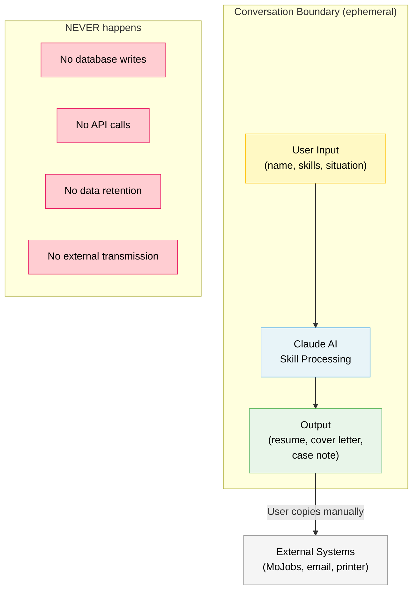
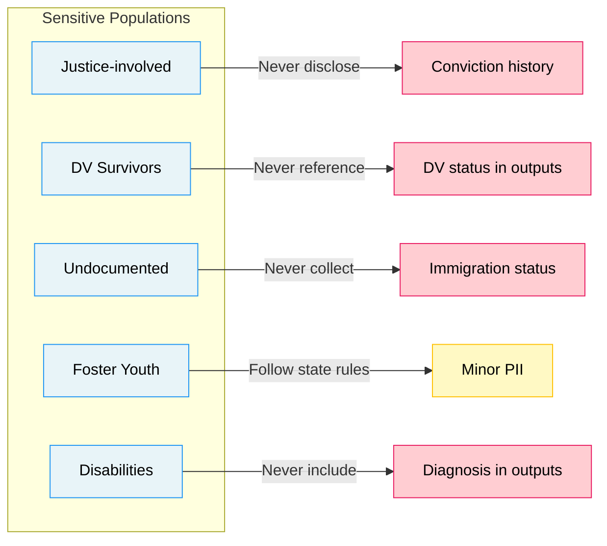

# Security and Privacy

Access to Jobs handles sensitive personal information from vulnerable populations. All contributors and deployers must follow these guidelines.

## Data Flow & Privacy Boundaries

### Sensitive Population Privacy Rules

---

## Personal Information Handling

### What the Skill Collects (via conversation)
- Name, contact information
- Employment history and skills
- Education level
- Barrier population indicators (justice involvement, disability status, veteran status, etc.)
- Income and benefit status

### Rules

1. **No persistent storage.** The skill operates within Claude's conversation context. It does not write to databases, APIs, or external services.
2. **No data leaves the conversation.** Outputs (resumes, cover letters, case notes) are generated in-conversation for the user to copy. Nothing is transmitted externally.
3. **Minimize collection.** The progressive intake model (see `schemas/jobseeker-intake.json`) collects only what the active module requires. Do not prompt for information that won't be used.
4. **No eligibility determinations.** The skill provides educational information only. It never confirms or denies eligibility for any program.

---

## For Deploying Organizations

If you deploy this skill in a shared environment (library kiosk, Job Center computer, staff-assisted session):

1. **Clear conversations** after each participant session
2. **Do not save** conversation transcripts containing PII without participant consent
3. **Post a notice** informing users that the AI assistant does not store their information
4. **Follow your organization's** existing data privacy policies (WIOA requires participant consent for data collection — see 20 CFR 677.175)

---

## For Contributors

- **Never commit real participant data** to this repository — not in test cases, examples, or documentation
- **Use fictional names and scenarios** in all evaluation files and prompt examples
- **Do not add analytics, tracking, or telemetry** to any skill files
- **Report security concerns** to dougdevitre@gmail.com

---

## Sensitive Populations

Several barrier populations require extra care:

| Population | Privacy Concern | Guideline |
|---|---|---|
| Justice-involved | Criminal record disclosure | Never include conviction details in resumes or cover letters |
| Domestic violence survivors | Safety risk from information exposure | Never reference DV status in outputs; omit employer names if safety concern |
| Undocumented individuals | Immigration enforcement risk | Do not collect or reference immigration status; focus on work-authorized pathways |
| Youth in foster care | Minor privacy protections | Follow state minor consent rules; limit PII collection |
| Individuals with disabilities | Medical information | Never include diagnosis in outputs; reference only functional capabilities |

---

## Reporting Vulnerabilities

If you discover a security or privacy issue in the skill, please email **dougdevitre@gmail.com** with:
- Description of the issue
- Steps to reproduce (if applicable)
- Suggested fix (if you have one)

We will acknowledge receipt within 48 hours and aim to resolve issues within 7 days.
