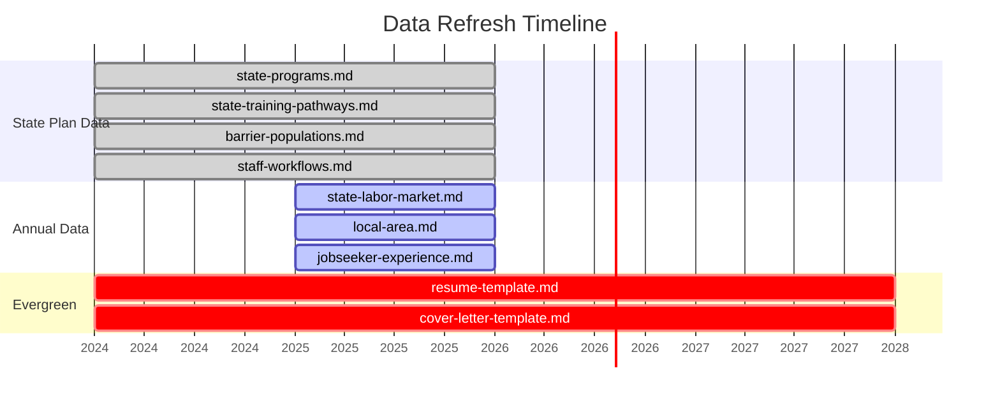
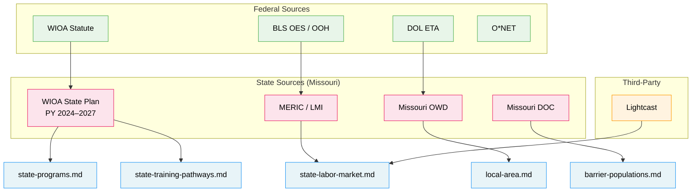

# Access to Jobs — Data Sources & Citations

All data in this skill is sourced from official government publications, federal agencies,
and state workforce agencies. This file documents every source for audit and update purposes.

## Data Refresh Schedule

### Source Hierarchy

---

## Primary Sources

### Federal
| Source | URL | Used In |
|---|---|---|
| WIOA (Workforce Innovation and Opportunity Act) | https://www.congress.gov/113/plaws/publ128/PLAW-113publ128.htm | Framework for all modules |
| DOL Employment and Training Administration | https://www.dol.gov/agencies/eta | WIOA implementation guidance |
| DOL WIOA State Plans | https://wioaplans.ed.gov/ | State plan repository |
| BLS Occupational Employment and Wage Statistics | https://www.bls.gov/oes/ | Wage data (Module 18) |
| BLS Occupational Outlook Handbook | https://www.bls.gov/ooh/ | Career projections |
| O*NET OnLine | https://www.onetonline.org/ | Occupation profiles |
| WOTC (Work Opportunity Tax Credit) | https://www.dol.gov/agencies/eta/wotc | Module 13 employer scripts |
| Federal Bonding Program | https://bonds4jobs.com/ | Module 13 employer scripts |

### Missouri (Reference Implementation)
| Source | URL | Used In |
|---|---|---|
| Missouri WIOA Combined State Plan, PY 2024–2027 | Via jobs.mo.gov | state-programs.md, state-training-pathways.md |
| MERIC (Missouri Economic Research and Information Center) | https://meric.mo.gov/ | state-labor-market.md |
| Missouri OWD (Office of Workforce Development) | https://jobs.mo.gov/ | All Missouri-specific files |
| Missouri Job Centers | https://jobs.mo.gov/find-a-job-center | local-area.md |
| Missouri Connections | https://missouriconnections.org/ | Career exploration, WorkKeys |
| Missouri Fast Track Scholarship | https://dhe.mo.gov/fasttrack | state-training-pathways.md |
| Missouri DOC Employment Services | Via doc.mo.gov | barrier-populations.md |
| Missouri Vocational Rehabilitation | https://dese.mo.gov/vocational-rehabilitation | state-programs.md |
| MOLearns | https://molearns.org/ | state-programs.md |
| MyDSS | https://mydss.mo.gov/ | state-programs.md |
| Lightcast (formerly Burning Glass / EMSI) | https://lightcast.io/ | Job posting volume data |

---

## Data Currency

| File | Data Vintage | Recommended Refresh |
|---|---|---|
| state-programs.md | PY 2024–2027 (Jan 2026) | Every 2 years (with new state plan) |
| state-labor-market.md | 2024 annual data | Annually (when new BLS/MERIC data publishes) |
| state-training-pathways.md | PY 2024–2027 | Every 2 years |
| local-area.md | 2024 local data | Annually |
| barrier-populations.md | PY 2024–2027 + DOC FY2024 | Every 2 years |
| resume-template.md | Evergreen | As needed |
| cover-letter-template.md | Evergreen | As needed |
| action-plan-template.md | Evergreen (MO resources dated) | Annually (resource links) |
| staff-workflows.md | PY 2024–2027 | Every 2 years |
| jobseeker-experience.md | 2025 wage data | Annually |

---

## Key Statistics Used (with Sources)

### Statewide Employment (state-labor-market.md)
- Total covered employment 2024: 2,898,200 → Source: MERIC/BLS QCEW
- 5-year growth 2020–2024: +223,100 (+8.3%) → Source: MERIC
- Unemployment rate 2024: 3.7% → Source: BLS LAUS
- Online job ads May 2024–Apr 2025: 719,000+ → Source: Lightcast
- Manufacturing share of GSP: 12.6% → Source: BEA/MERIC

### Barrier Populations (barrier-populations.md)
- DOC supervised population: 75,000+ → Source: Missouri DOC Annual Report
- DOC unemployment rate: ~35% → Source: Missouri WIOA State Plan
- Supervised unemployed: ~18,500 → Source: Missouri WIOA State Plan
- Annual releases: ~12,500 → Source: Missouri WIOA State Plan
- Civilian veterans: 341,191 (7.1%) → Source: ACS/VA
- Veteran unemployment: 2.7% → Source: BLS
- Youth in foster care: 12,000+ → Source: Missouri DSS
- DYS commitments FY2024: 577 → Source: Missouri DYS

### Performance (state-programs.md)
- Employment Rate Q2: 73.49% → Source: Missouri OWD WIOA Annual Report
- Employment Rate Q4: 73.42% → Source: Missouri OWD WIOA Annual Report
- Credential Attainment: 63.95% → Source: Missouri OWD WIOA Annual Report
- Services provided PY2024: 532,000+ to 70,000 individuals → Source: Missouri OWD

---

## Disclaimer

This skill provides **educational information only**. It does not make eligibility
determinations, provide legal advice, or guarantee program availability. Users should
always verify current information with their local American Job Center or state
workforce agency.

Statistics are point-in-time and may not reflect current conditions. Links and
program names may change. Contributors should verify sources before updating.
