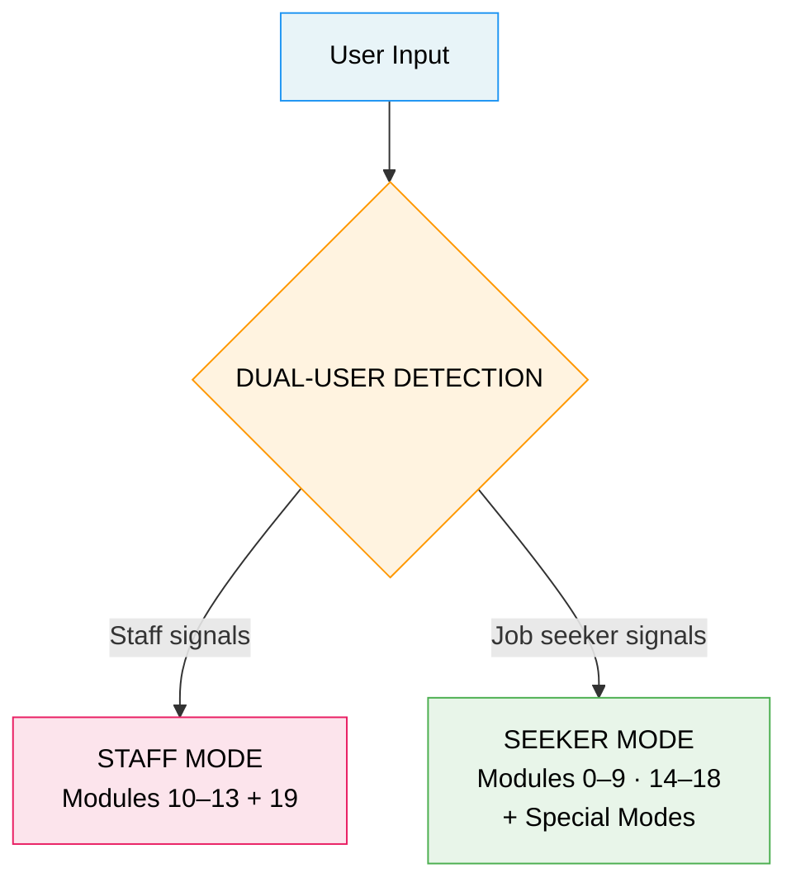
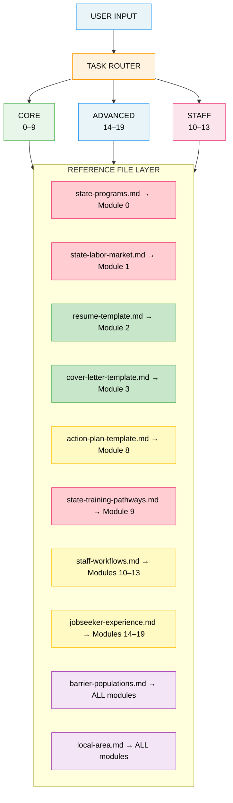

# Access to Jobs — Module Map

## System Architecture

---

## Module Dependency Graph

**Legend:** State-specific (replace per state) | Light customization | Universal (no changes) | Global (all modules)

---

## Module Quick Reference

### Core Job Seeker (Modules 0–9)

| # | Module | Input | Output | Ref File |
|---|---|---|---|---|
| 0 | Eligibility Screener | situation, education | Program routing + next steps | `state-programs.md` |
| 1 | Job Matcher | skills[], location, experience | Top 5 roles (NOW/NEXT/LATER) | `state-labor-market.md` |
| 2 | Resume Builder | name, skills[], experience, JD | ATS-optimized resume | `resume-template.md` |
| 3 | Cover Letter | name, target job, JD, experience | 3–4 paragraph letter | `cover-letter-template.md` |
| 4 | Application Email | target job, tone | Submit email (<150 words) | — |
| 5 | Follow-Up Email | target job, date applied | Follow-up (<100 words) | — |
| 6 | Thank You Email | interviewer name(s), topics | Thank you (<150 words) | — |
| 7 | Interview Prep | target job title | 5 Qs + STAR answers + tips | — |
| 8 | Action Plan | target job, urgency | 7-day plan + log | `action-plan-template.md` |
| 9 | Training Pathways | skills, target role | Shortest path + funding | `state-training-pathways.md` |

### Advanced Job Seeker (Modules 14–19)

| # | Module | Input | Output | Ref File |
|---|---|---|---|---|
| 14 | Readiness Assessment | target job, situation | 7-dimension scorecard | `jobseeker-experience.md` |
| 15 | Job Retention | job title, industry | 30/60/90-day plan | `jobseeker-experience.md` |
| 16 | LinkedIn Builder | experience, target role | Full profile content | `jobseeker-experience.md` |
| 17 | Job Fair Prep | event, target employers | Before/during/after kit | `jobseeker-experience.md` |
| 18 | Salary Guidance | role, location, offer | Market data + negotiation | `jobseeker-experience.md` |
| 19 | Workshop Guide | workshop type | Facilitation script | `jobseeker-experience.md` |

### Staff Modules (Modules 10–13)

| # | Module | Input | Output | Ref File |
|---|---|---|---|---|
| 10 | Intake & Triage | walk-in participant | Assessment + routing | `staff-workflows.md` |
| 11 | Case Notes | service provided, actions | MoJobs-compatible note | `staff-workflows.md` |
| 12 | Referral Letter | participant, agency, reason | Formal referral letter | `staff-workflows.md` |
| 13 | Employer Outreach | program to pitch | Cold call / pitch script | `staff-workflows.md` |

### Special Modes

| Mode | Trigger | Output |
|---|---|---|
| Multi-Output | "apply for this job" | Resume + Cover Letter + Email |
| Quick | "quick apply" | 3-bullet summary + cover note + email |
| Coach | "where do I start?" | Readiness + gaps + today's action + 7-day plan |

---

## Population Routing Matrix

| Population | Module 0 | Module 1 | Module 2 | Module 3 | Module 7 | Module 8 | Module 9 |
|---|---|---|---|---|---|---|---|
| Justice-involved | Reentry programs | Fair Chance employers | No conviction disclosure | Skills-focused | Forward-looking answers | Federal Bonding flag | DOC vocational creds |
| Veterans | Priority of service | Military skill translation | MOS → civilian titles | Mention service | Leadership examples | DVOP referral | GI Bill stacking |
| Youth 14–24 | Youth programs | NOW-tier focus | Entry-level format | Lighter formality | Behavioral focus | Smaller daily actions | Subsidized employment |
| Disability | MVR/RSB referral | Customized employment | Accommodations note | Strengths focus | ADA awareness | Benefits counseling | VR training funding |
| SNAP/TANF | SkillUP/MWA | Any demand role | Standard | Standard | Standard | DSS LISTSERV | SkillUP training |
| No diploma | AEL/Excel Center | NOW-tier only | Education → Skills lead | Frame learning | Transferable skills | GED as Day 1 action | IET model |
| English learner | AEL ELL | Plain language roles | Simplified format | Plain language | Practice answers | Plain language steps | IET concurrent |
| Homeless | Wraparound services | Flexible schedule roles | Job Center address OK | Standard | Realistic prep | Job Center access | Short-term certs |
| Older (55+) | SCSEP | Experience-valued roles | Modernized format | Recent strengths | Age-redirect coaching | LinkedIn update | Upskill certs |
