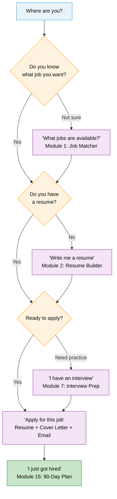

# Quick Start — Access to Jobs

**AI-Powered Job Search Help** — free and open source.

---

## Your Job Search Journey

---

## What Can It Do For You?

| Say this | The assistant will help with |
|---|---|
| "I need a job" | Programs available to you |
| "Write me a resume" | Resume tailored to the position |
| "Cover letter for this job" | Professional letter customized for you |
| "Apply for this job" | Resume + cover letter + application email |
| "I have an interview tomorrow" | 5 practice questions with sample answers |
| "What jobs are available?" | Top 5 jobs based on your skills |
| "I need training" | Shortest path to a credential with funding options |
| "I just got hired" | First 90 days plan |

**Tip:** Paste the full job posting into the chat for the best results.

---

## What You'll Need

The assistant only asks for what it needs. For best results, have ready:

- **Your name** (for resumes and letters)
- **Your skills and experience** (past jobs, certifications, training)
- **The job you want** (job title or industry)
- **The job posting** (copy and paste from the listing)

---

## Extra Help for Your Situation

If any of these apply to you, just mention it — the assistant adjusts automatically:

| Your situation | The assistant will also include |
|---|---|
| Veteran | Priority of service, military skills translation |
| Justice-involved / reentry | Fair Chance employers, no conviction disclosure |
| Youth (14–24) | Youth-specific programs, age-appropriate tone |
| Disability | Vocational Rehabilitation referral, benefits counseling |
| Receiving SNAP/TANF | Training programs, childcare and transportation support |
| No high school diploma | Free adult education and diploma programs |
| Experiencing homelessness | Job Center computer access, wraparound services |
| Age 55+ | Resume modernization, SCSEP programs |

---

## Get Help In Person

Visit your local **American Job Center**:
- Free computers for job searching
- Resume help
- Connections to training programs
- Interpretation services available

**Missouri:** [jobs.mo.gov](https://jobs.mo.gov) → "Find a Job Center"

---

## Privacy

- The assistant **does not save** your personal information
- Your conversations are private
- Your information is never shared with employers or agencies without your permission

---

*Access to Jobs provides educational information only. It does not determine program eligibility.
Always check with your local American Job Center for official enrollment.*

---

**Disponible en español:** [guia-rapida-es.md](guia-rapida-es.md)
