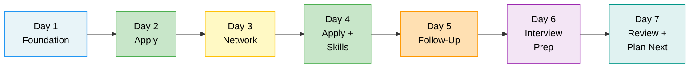
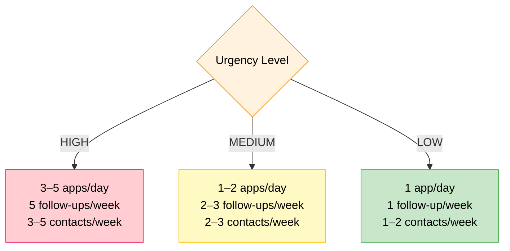

# 7-Day Action Plan Template
## Access to Jobs — Workforce Navigator — Module 8

## 7-Day Timeline



### Urgency Calibration



---

## URGENCY TIERS

### HIGH URGENCY (need work immediately)
Front-load applications. Apply to 3–5 jobs per day.
Prioritize: any open role that matches 60%+ of skills.
Do not wait for perfect fit. Volume + follow-up = results.

### MEDIUM URGENCY (need work within 30–60 days)
Balanced approach: 2 applications per day + networking + skill building.
Prioritize: roles with strong fit (70%+).

### LOW URGENCY (career transition / no immediate pressure)
Research-heavy first week. Skill gaps. Network first, apply second.
Prioritize: long-game strategy, learning, informational interviews.

---

## 7-DAY PLAN SCAFFOLD

```
DAY 1 — FOUNDATION
[ ] Review/finalize resume (use resume module)
[ ] Draft master cover letter template
[ ] Set up or update LinkedIn profile
[ ] Identify 10 target job postings
[ ] Save job search URLs (Indeed, LinkedIn, local boards)

DAY 2 — APPLY
[ ] Tailor resume to top 3 job postings
[ ] Customize cover letter for each
[ ] Submit applications (3 minimum)
[ ] Log each application: company, role, date, contact

DAY 3 — NETWORK
[ ] Contact 2–3 people in target field (LinkedIn, email, phone)
[ ] Message any former supervisors or colleagues
[ ] Join 1 relevant professional group (online or local)
[ ] Attend a job fair if available this week

DAY 4 — APPLY + SKILLS
[ ] Submit 2 more applications
[ ] Identify 1 skill gap from job postings
[ ] Begin free training (Coursera, LinkedIn Learning, YouTube)
[ ] Review workforce resources for training support

DAY 5 — FOLLOW-UP
[ ] Follow up on any applications submitted 7+ days ago
[ ] Send thank-you notes from any networking conversations
[ ] Research companies you've applied to (prepare for calls)
[ ] Check job boards for new postings

DAY 6 — INTERVIEW PREP
[ ] Run MODULE 7 interview prep for top target role
[ ] Practice answers out loud (record yourself if possible)
[ ] Prepare 3 questions to ask interviewers
[ ] Pick out interview outfit, plan commute/logistics

DAY 7 — REVIEW + PLAN NEXT WEEK
[ ] Count applications submitted this week (goal: 5–10 for high urgency)
[ ] Assess response rate — adjust target roles if needed
[ ] Celebrate progress (seriously — this is hard work)
[ ] Set next week's application, network, and follow-up targets
```

---

## APPLICATION LOG SCHEMA

Use this to track progress (or generate a CSV):

| Date | Company | Job Title | Source | Contact | Submitted | Followed Up | Status |
|------|---------|-----------|--------|---------|-----------|-------------|--------|
| | | | | | ☐ | ☐ | |

---

## DAILY MINIMUMS BY URGENCY

| Urgency | Applications/day | Follow-ups/week | Networking contacts/week |
|---------|-----------------|-----------------|--------------------------|
| High | 3–5 | 5 | 3–5 |
| Medium | 1–2 | 2–3 | 2–3 |
| Low | 1 | 1 | 1–2 |

---

## STC RESOURCE REMINDERS

Encourage user to check with case manager for:
- Resume review services
- Mock interview scheduling
- Job fair calendars
- Training vouchers or certifications
- Transportation or childcare support for interviews

---

## MISSOURI-SPECIFIC DAILY RESOURCES

**Add to Day 1 of every plan:**
- Register at jobs.mo.gov (MoJobs account)
- Locate nearest Missouri Job Center → jobs.mo.gov/find-a-job-center
- Sign up for DSS OWCI LISTSERV if SNAP/TANF recipient (job fair + hiring event alerts)
- Explore missouriconnections.org (career exploration + WorkKeys info)

**Add to Day 3 (Networking):**
- Contact nearest Missouri Job Center about upcoming job fairs
- Check if user qualifies for DVOP/CODL services (veterans) or SkillUP (SNAP recipients)
- Research local Workforce Development Board (WDB) events in their region

**Add to Day 4 (Skills):**
- Missouri Fast Track Scholarship application (dhe.mo.gov/fasttrack) if training is needed
- WorkKeys assessment available free at Job Centers — schedule it
- SkillUP enrollment if SNAP recipient

**Add to Day 7 (Review):**
- Did user connect with a Job Center career advisor? (Priority action if not)
- Are there any WIOA programs the user should be co-enrolled in?
- Review jobs.mo.gov for new postings in target region

---

## ST. LOUIS / METRO EAST REGIONAL NOTE

For users in St. Louis City, St. Louis County, or Metro East (Swansea, Belleville, O'Fallon IL area):
- St. Louis Region = 35% of all Missouri employment (1,056,400 workers)
- Largest industries: Retail Trade (194,600+), Healthcare, Professional Services
- High-growth sectors: Healthcare, IT, Professional Services, Construction
- Cross-border employment (Illinois ↔ Missouri) is common and normal — do not limit job search to one state
- St. Louis regional Job Centers serve city + county; Metro East (IL) served by Illinois workNet
