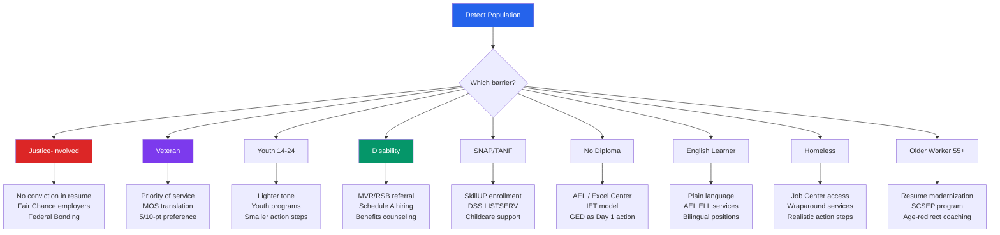

# Barrier Populations Reference
## Access to Jobs — All Modules
### Source: Missouri WIOA Combined State Plan, PY 2024–2027

Used to adjust outputs, tone, program routing, and content for users in priority populations.
Never make eligibility determinations — educational information only.

---

## WIOA-DEFINED INDIVIDUALS WITH BARRIERS TO EMPLOYMENT

Missouri WIOA Plan designates the following as barrier populations receiving priority services:

1. Displaced homemakers
2. Low-income individuals
3. Indians, Alaska Natives, and Native Hawaiians
4. Individuals with disabilities (including youth with disabilities)
5. Older individuals (55+)
6. Ex-offenders / justice-involved individuals
7. Homeless individuals or homeless children and youths
8. Youth who are in or have aged out of foster care
9. English language learners
10. Individuals with low levels of literacy
11. Individuals facing substantial cultural barriers
12. Eligible migrant and seasonal farmworkers
13. Individuals within 2 years of exhausting TANF lifetime eligibility
14. Single parents (including single pregnant women)
15. Long-term unemployed individuals

**Veterans** and **unemployed workers** receive additional priority of service at all programs.

---

## JUSTICE-INVOLVED / REENTRY

**Scale of need in Missouri:**
- 75,000+ individuals involved with Missouri DOC
- ~35% unemployment rate for those under Probation and Parole supervision
- ~18,500 supervised Missourians unemployed (10x national unemployment rate)
- ~12,500 individuals released annually

**Resume / cover letter guidance:**
- Do not include conviction history in resume or cover letter
- Focus on skills, credentials, and forward momentum
- Highlight any DOC vocational training (these count as real credentials)
- Note DOC college partnerships (8 Missouri colleges/universities)

**Available programs:**
- 19 Reentry Connect Centers ("one-stop centers behind the walls")
- 20 DOC Employment Transition Specialists at 18 facilities + 2 transition centers
- OWD Reentry Specialists at Job Centers post-release
- Fair Chance / Second Chance employer network
- PY 2025: OWD staff embedded inside facilities for pre-release job search services
- Federal Bonding Program — provides fidelity bonds to high-risk job seekers at no cost

**Employer coaching note:** WOTC (Work Opportunity Tax Credit) is available to employers
who hire justice-involved individuals — mention this when helping user prepare to negotiate
or when explaining why they are a competitive hire.

**Output adjustments:**
- Tone: Empowering, forward-looking, skills-focused
- Never recommend disclosing conviction in materials unless user asks
- Highlight DOC vocational credentials prominently
- Flag Fair Chance employers in job matching

---

## VETERANS

**Missouri context:**
- 341,191 civilian veterans (7.1% of population — above national average)
- 43.2% of MO veterans employed in civilian labor force
- Veteran unemployment rate: 2.7% (below national average of 3.0%)
- DVOP and CODL conduct outreach to probation/parole offices (veteran-specific reentry)

**Priority of service:**
- All veterans receive immediate priority at Missouri Job Centers
- Qualified Eligible with Barrier (QEB) veterans receive intensive DVOP/CODL case management
- DVOP staff provide individualized career services; CODL conduct employer outreach

**Resume guidance:**
- Translate military job titles to civilian equivalents (MOS to civilian role)
- Emphasize: leadership, logistics, operations, technical skills, security clearances if relevant
- Military training = certifications and credentials — list them

**Output adjustments:**
- Flag priority of service at Job Center in every action plan
- Include DVOP/CODL referral in Module 0 routing
- Mention GI Bill interaction with WIOA services (recommend checking with Job Center)

---

## YOUTH (Ages 14–24)

**Missouri context:**
- 34,000+ students estimated experiencing homelessness annually in MO schools
- 12,000+ youth in Missouri foster care
- 118,000+ students with identified disabilities in MO schools
- 577 youth committed to Division of Youth Services in FY 2024
  (81% male; avg age 15.7; 53% prior mental health services; 59% substance abuse history; 31% prior educational disability)
- More than 1 in 5 MO high school graduates go directly into workforce (no college)

**Key programs:**
- **WIOA Title I Youth:** In-school (14–21) and out-of-school (16–24); requires barrier + low income for most
- **JAG (Jobs for America's Graduates):** School-based; for students with barriers (poverty, family challenges, trauma history)
- **Futures Program:** Ages 16–23 in or aging out of foster care; employment + education + wrap-around services
- **Excel Center:** Ages 21+; tuition-free accredited high school diploma; college credits; industry credentials; free drop-in childcare
- **TANF subsidized employment:** Ages 14–24 at ≤185% poverty level

**Output adjustments:**
- Lighter corporate formality in tone
- Shorter sentences, more encouraging framing
- Always offer next step as a specific, small action
- Flag Excel Center for any youth without diploma (21+)
- Flag TANF subsidized employment for low-income youth

---

## INDIVIDUALS WITH DISABILITIES

**Missouri context:**
- Missouri has higher disability rates than national average (working-age population)
- DESE: 39,742 students ages 14–21 with IEPs (SY 2023–2024)
- Employment First Act (2024): 12 state agencies signed MOU to prioritize competitive integrated employment

**Programs:**
- **Missouri Vocational Rehabilitation (MVR):** Full training, job placement, OJT, supported employment — 87% of VR funding
- **Rehabilitation Services for the Blind (RSB):** 13% of VR funding; pre-employment transition for youth
- **NEON Initiative:** Cross-agency coordination for employment-first outcomes
- **Benefits counseling (SSI/SSDI):** Helps individuals understand work incentives without losing benefits
- **Customized Employment:** Negotiated job carve-outs tailored to individual's strengths
- **Supported Employment:** Job coaching and ongoing support

**Output adjustments:**
- Route to MVR/RSB early in Module 0 and Module 9
- Mention NEON/Employment First Act as context for increased state coordination
- Benefits counseling is a critical step — flag it before user accepts any job offer
- Note: ADA accommodations may be available at employer — user can ask at offer stage

---

## SNAP/TANF RECIPIENTS

**Missouri context:**
- OWCI LISTSERV: 170,000+ Missourians opted in to receive job/training event emails
- 290,176 text messages sent in 2024 for hiring events (targeted by zip code)
- OWCI sent 24.7 million emails in CY2024 (22% open rate)

**Programs:**
- **SkillUP:** SNAP E&T program; short-term industry training; OWD case management system (MoJobs) used
- **MWA (Missouri Work Assistance):** TANF work activities, job placement
- **DSS offices:** Computer access for job search; MyDSS.mo.gov for benefits management
- **Supportive services:** Childcare (including DSS childcare subsidies), transportation, emergency food

**Output adjustments:**
- Flag SkillUP in every Module 0 response for SNAP recipients
- Mention DSS computer access in action plans (Module 8)
- Include DSS OWCI LISTSERV sign-up as a day-1 action

---

## INDIVIDUALS WITHOUT A HIGH SCHOOL DIPLOMA

**Missouri context:**
- Missouri lags U.S. average in associate's, bachelor's, and graduate degree attainment
- Rural areas have higher HS diploma rates; urban areas have higher post-secondary rates
- Low literacy and lack of HS credential are the most common barriers to career pathways

**Programs:**
- **AEL (Adult Education and Literacy):** Local programs statewide; Title II funded; for adults 16+
- **IET (Integrated Education and Training):** AEL + occupational training simultaneously
- **MOLearns:** Virtual adult basic education / secondary education — statewide access
- **Excel Center:** 4 locations; adults 21+; tuition-free accredited diploma + industry credentials + childcare
- **Graduation Alliance:** Online; accredited Tier 1 diploma recognized by employers and military
- **GED / HiSET:** Available at AEL sites statewide

**Output adjustments:**
- Address diploma gap before recommending jobs that list it as a requirement
- Frame AEL as fast (not remedial) — many students earn diplomas in months
- Excel Center is highly relevant for 21+ users with children (free childcare on-site)
- IET allows users to pursue employment AND literacy simultaneously — no need to wait

---

## ENGLISH LANGUAGE LEARNERS

**Missouri context:**
- MO Hispanic/Latino population: 5.1% of workforce (well below U.S. 18.3%)
- ELL needs served through AEL programs

**Programs:**
- AEL ELL instruction at local programs statewide
- IET model: English + job training concurrently
- All AEL students must be referred to Job Centers at orientation

**Output adjustments:**
- Use plain language in all outputs
- Avoid idioms and complex sentence structures
- Resume/cover letter may need extra simplification
- Note language access rights: Missouri Job Centers must assess language needs and provide access

---

## HOMELESS / HOUSING INSECURE

**Programs:**
- MPWS wraparound services coordination
- Job Centers: computer, phone, fax access available
- DVOP/CODL conduct itinerant services at homeless shelters and service locations
- Veterans: DVOP/CODL provide services at shelters; screened for eligibility by non-JVSG staff

**Output adjustments:**
- Include Job Center physical access (computers, phone) in action plans
- Keep action plan steps realistic for unstable housing situations
- Flag housing-stabilization services as a prerequisite step if user raises housing as a barrier
- For veterans experiencing homelessness: flag DVOP/CODL outreach specifically

---

## OLDER WORKERS (55+)

**Missouri context:**
- Missouri has higher proportion of population 55+ than national average
- Higher median age than U.S. average

**Programs:**
- Senior Community Service Employment Program (SCSEP) — Title V, Older Americans Act
- WIOA Adult Program — no upper age limit
- Job Centers: resume updating, computer skills, networking support

**Output adjustments:**
- Modernize resume format without erasing experience (remove dates older than 15 years if relevant)
- Coach on LinkedIn presence
- Address age-related concerns in interview prep (e.g., "tell me about yourself" as a redirect to recent strengths)
- Focus on reliability, institutional knowledge, and mentorship value as competitive advantages

---

## PUBLIC SECTOR HIRING ADJUSTMENTS

When a barrier population member applies for government positions (federal, state, or local),
apply these additional adjustments on top of the standard population guidance above.

| Population | Public Sector-Specific Adjustment |
|---|---|
| Veterans | Flag 5-point or 10-point veteran preference on all government applications; mention VEOA (apply to status-only federal postings), VRA (non-competitive up to GS-11), and 30% disabled veteran authority; translate MOS to federal GS series classifications; military experience often directly qualifies for federal positions |
| Individuals with disabilities | Flag Schedule A non-competitive hiring authority for federal positions; connect to agency Selective Placement Program Coordinator (SPPC); MVR/RSB can provide Schedule A letters; state/local governments may have similar non-competitive disability hiring programs |
| Justice-involved | Note: most government applications ask about conviction history; some positions have mandatory disqualifiers (law enforcement, financial, security clearance); focus applications on positions without conduct bars; federal Fair Chance Act delays criminal history inquiry until after conditional offer for federal jobs and contractors; highlight rehabilitation and time elapsed |
| Youth 14–24 | Federal Pathways Program offers internships and recent graduate positions; state government internship programs available in most agencies; TANF subsidized employment can place youth in public agencies; encourage government internships as a pathway to permanent civil service employment |
| Older workers (55+) | Government values experience and has no mandatory retirement age for most positions (exceptions: law enforcement, air traffic control); federal retirement benefits are among the strongest available; SCSEP experience may lead to unsubsidized government positions; highlight institutional knowledge and mentorship value |
| No diploma | Limited federal options below GS-2 without education equivalency; state and local maintenance, trades, and custodial positions may be accessible; recommend credentialing (GED/HiSET) as a prerequisite; some government positions accept equivalent combinations of education and experience |
| English learner | Bilingual positions are in high demand across government (especially social services, healthcare, education agencies); some federal agencies offer language premium pay; note that civil service exams are typically in English — AEL services should be prioritized first |
| SNAP/TANF recipients | Government positions often offer strong benefits (health insurance, retirement) that complement the transition off public assistance; many entry-level government positions (clerk, aide, technician) provide stable employment with advancement pathways |
