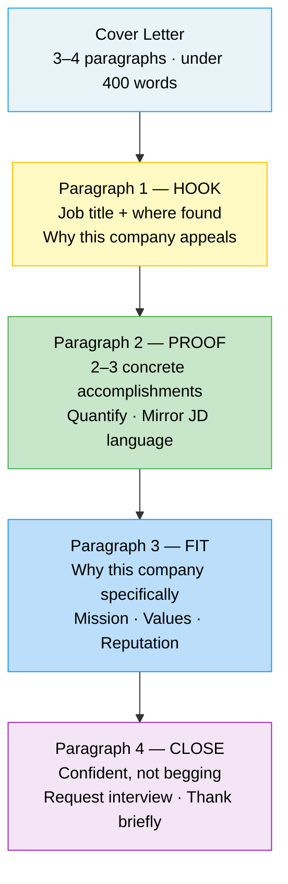

# Cover Letter Template Reference
## Access to Jobs — Workforce Navigator — Module 3

## Cover Letter Structure



---

## STRUCTURE (3–4 paragraphs, under 400 words)

### Paragraph 1 — HOOK
- State the exact job title and where you found it
- One sentence on why this company/role specifically appeals to you
- Do NOT start with "My name is..." or "I am writing to apply..."

### Paragraph 2 — PROOF (strongest paragraph)
- 2–3 concrete accomplishments that match the JD requirements
- Quantify where possible
- Mirror language from the job description

### Paragraph 3 — FIT (optional but recommended)
- Why this company specifically (mission, values, reputation, location)
- Connect your background to their needs in 1–2 sentences

### Paragraph 4 — CLOSE
- Confident, not begging
- Request next step (interview, call, conversation)
- Thank them briefly
- Sign off: Sincerely, / Best regards, / With appreciation,

---

## FULL TEMPLATE

```
[Date]

[Hiring Manager Name or "Hiring Team"]
[Company Name]
[Company Address if known]

Re: Application for [Job Title]

Dear [Hiring Manager Name / Hiring Team],

[HOOK: Opening sentence connecting to company + role. 1–2 sentences.]

[PROOF: 2–3 accomplishments. "In my role as [X], I [action verb] which resulted in [outcome]."
Keep each to 1–2 sentences. Use numbers when available.]

[FIT: Why this company. Connect their mission or reputation to your background.]

I would welcome the opportunity to discuss how my experience can contribute to [Company Name].
Thank you for your time and consideration.

Sincerely,

[Full Name]
[Phone] | [Email]
```

---

## TONE VARIANTS

### Professional (default)
Formal, confident, clear. No contractions. No slang.
Best for: corporate, government, healthcare, finance roles.

### Confident
Direct, results-first, assertive but not arrogant.
Best for: sales, management, technical roles.

### Friendly
Warm, conversational, still professional.
Best for: nonprofits, education, social services, retail.

---

## COMMON MISTAKES

- Starting with "I" (weak opener)
- Summarizing the resume instead of adding to it
- Generic letters not tailored to the company
- Over-explaining employment gaps (address briefly or not at all)
- Ending with "I hope to hear from you" (passive — replace with confident CTA)
