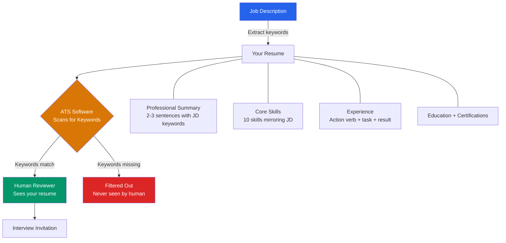

# Resume Template Reference
## Access to Jobs — Workforce Navigator — Module 2

---



---

## ATS RULES

1. Use standard section headings (Summary, Skills, Experience, Education)
2. No tables, columns, text boxes, headers/footers — ATS cannot parse them
3. Font: Arial, Calibri, or Times New Roman only
4. Mirror exact keywords from the job description
5. Use bullet points, not paragraphs, for experience
6. Dates format: MM/YYYY or YYYY only
7. File format: .docx or plain text (not PDF unless specified)

---

## FULL TEMPLATE

```
[FIRST LAST NAME]
[City, State] | [Phone] | [Email] | [LinkedIn URL if provided]

─────────────────────────────────────────────────
PROFESSIONAL SUMMARY
─────────────────────────────────────────────────
[2–3 sentences. Lead with years of experience and role type.
Include 2–3 top skills that match the JD. End with value delivered.]

─────────────────────────────────────────────────
CORE SKILLS
─────────────────────────────────────────────────
[Skill 1] | [Skill 2] | [Skill 3] | [Skill 4] | [Skill 5]
[Skill 6] | [Skill 7] | [Skill 8] | [Skill 9] | [Skill 10]

(Include hard skills + soft skills relevant to JD. Mirror JD keywords exactly.)

─────────────────────────────────────────────────
PROFESSIONAL EXPERIENCE
─────────────────────────────────────────────────
[Job Title] | [Employer Name] | [City, State] | [MM/YYYY – MM/YYYY or Present]
• [Action verb + task + result/impact. Quantify if possible.]
• [Action verb + task + result/impact.]
• [Action verb + task + result/impact.]

[Job Title] | [Employer Name] | [City, State] | [MM/YYYY – MM/YYYY]
• [Action verb + task + result/impact.]
• [Action verb + task + result/impact.]

─────────────────────────────────────────────────
EDUCATION
─────────────────────────────────────────────────
[Degree or Certificate] — [Institution Name] | [City, State] | [Year]

─────────────────────────────────────────────────
CERTIFICATIONS (if applicable)
─────────────────────────────────────────────────
• [Certification Name] — [Issuing Body] | [Year]

─────────────────────────────────────────────────
VOLUNTEER / COMMUNITY (optional)
─────────────────────────────────────────────────
• [Role] — [Organization] | [Year]
```

---

## ACTION VERB BANK

**Leadership:** Led, Managed, Directed, Supervised, Coached, Coordinated
**Operations:** Streamlined, Implemented, Maintained, Operated, Processed
**Customer:** Served, Assisted, Resolved, Responded, Supported
**Results:** Increased, Reduced, Improved, Achieved, Delivered, Generated
**Communication:** Presented, Trained, Documented, Reported, Collaborated

---

## COMMON MISTAKES TO AVOID

- Using "responsible for" (weak — replace with action verb)
- Listing duties instead of results
- Generic summaries with no keywords
- Including photos, birthdate, or marital status
- Unexplained employment gaps (address in cover letter instead)

---

## ENTRY-LEVEL GUIDANCE

If user has limited work experience:
- Lead with Education or Skills section instead of Experience
- Include internships, volunteer work, school projects
- Emphasize transferable skills from any context (retail, childcare, community)
- Add a "Relevant Projects" section if applicable
