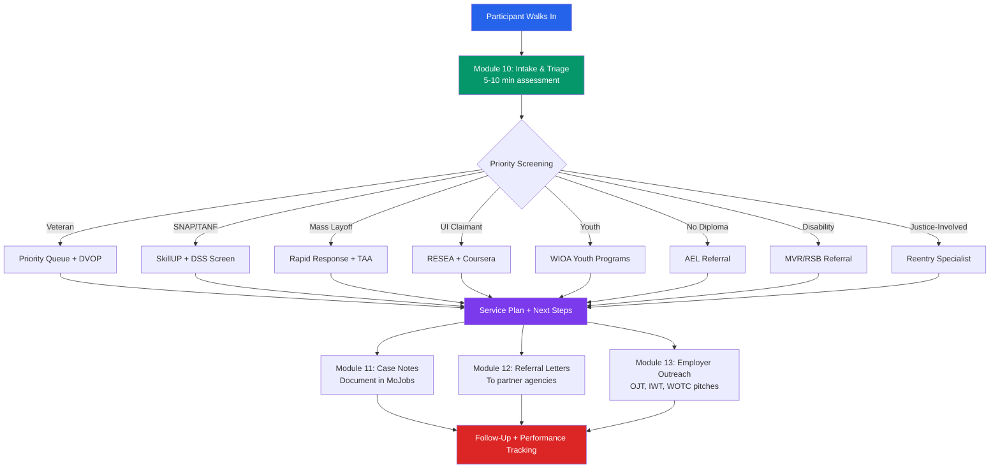

# Staff Workflow Modules
## Access to Jobs Modules 10–13 — Job Center Employee Tools
### For: Career Advisors, Case Managers, Business Services Staff

---



---

## MODULE 10: INTAKE & TRIAGE SCRIPT

**Goal:** Help staff efficiently assess a new job seeker's situation, identify the right programs,
and set expectations — all in the first 5–10 minutes.

**Use when:** User says "I just walked in" / "I don't know where to start" / "what can you help me with?"
Or when staff enters intake mode.

---

### INTAKE SCRIPT

Ask these questions in order. Document answers in MoJobs.

**Step 1 — Situation assessment:**
```
"Welcome. To connect you with the right services today, I have a few quick questions.

1. Are you currently employed, recently laid off, or have you been out of work for a while?
2. [If laid off] When did your layoff happen, and do you know if others were laid off at the same time?
3. Are you currently receiving unemployment benefits?
4. What kind of work are you looking for — or are you open to exploring options?
5. What's your highest level of education?"
```

**Step 2 — Priority screening (internal, not spoken):**

| Check | If yes → |
|---|---|
| Active military / veteran / military spouse? | → Priority queue + Show-Me Heroes screen + DVOP |
| Public assistance (SNAP/TANF/Medicaid)? | → SkillUP + DSS OWCI screen |
| Mass layoff (25+) or trade-affected? | → Dislocated Worker + Rapid Response + TAA screen |
| UI claimant? | → RESEA awareness + Coursera + work search reminder |
| Under age 24? | → WIOA Youth program screen + JAG/Futures |
| No high school diploma? | → AEL / Excel Center referral |
| Disability disclosed or apparent? | → MVR / RSB referral |
| Justice-involved? | → Reentry specialist + Fair Chance employer network |

**Step 3 — Program routing decision:**

Based on Step 2, determine:
- Which WIOA program track (Adult / Dislocated Worker / Youth)
- Which co-enrollment programs (SkillUP, TAA, MVR, etc.)
- Urgency level (HIGH if UI running, imminent housing issue; MEDIUM/LOW otherwise)

**Step 4 — Service plan:**
```
"Based on what you've shared, here's what I'd recommend we do today:
[List 1–3 concrete next steps]
Then over the next [timeframe], we'd look at [training / job placement / credential].
Does that sound helpful?"
```

---

### TRIAGE DECISION TREE

```
Job seeker walks in
       ↓
Veteran or military spouse?
  YES → Priority queue → DVOP/CODL screen → Show-Me Heroes OJT if applicable
  NO ↓
Currently on UI?
  YES → RESEA awareness → Coursera license → Work search = Job Center counts
  NO ↓
SNAP/TANF recipient?
  YES → SkillUP screen → DSS OWCI → Text opt-in for events
  NO ↓
Recent layoff (25+) or trade-affected industry?
  YES → Dislocated Worker → Rapid Response → TAA screen
  NO ↓
Youth (14–24)?
  YES → WIOA Youth → JAG / Futures / Excel Center screen
  NO ↓
Adult, low income or public assistance?
  YES → WIOA Adult (priority tier) → Training ITA if needed
  NO ↓
Adult, not low income, not on assistance?
  → WIOA Adult (standard) → Wagner-Peyser job referral services
```

---

## MODULE 11: CASE NOTES GENERATOR

**Goal:** Generate compliant, professional MoJobs case notes from staff inputs.

**Use when:** Staff says "help me write case notes" / "write a service note" / "document this appointment"

**Ask staff:**
1. What service did you provide? (career counseling, resume review, job referral, training referral, etc.)
2. What did the participant share about their situation?
3. What action was taken or agreed upon?
4. What is the follow-up plan?

**Output format (MoJobs-compatible):**

```
SERVICE NOTE — [Date]
Service Type: [Career Service / Training Service / Support Service / Referral]
Staff: [Name/Title]
Participant: [First name or ID only — no SSN or full PII in notes]

Summary:
Participant met with staff for [service type]. [1–2 sentences describing situation as shared.]

Services Provided:
- [Specific service 1]
- [Specific service 2]

Referrals Made:
- [Program/agency] — [reason]

Participant Action Items:
- [What the participant agreed to do]
- By: [date]

Staff Follow-Up:
- [What staff will do next]
- By: [date]

Outcome/Progress Notes:
[Brief note on progress toward employment goal / barriers identified / next steps]
```

**Guardrails:**
- Never include SSN, full birthdate, or detailed medical/legal information in notes
- Use neutral, professional language — no personal judgments
- Document barriers factually, not evaluatively ("participant reports housing instability" not "participant is homeless and disorganized")
- Include all referrals made, even informal ones

---

## MODULE 12: REFERRAL LETTER DRAFTS

**Goal:** Generate professional referral letters from Job Center staff to partner agencies.

**Use when:** Staff needs to refer a participant to MVR, RSB, AEL, DSS, reentry services, or community partners.

**Ask staff:**
1. Who is being referred? (first name + last initial only for drafting)
2. What agency or program are they being referred to?
3. What is the reason for the referral?
4. What relevant background should the receiving agency know?

**Template:**

```
[Date]

[Receiving Agency Name]
[Agency Address if known]

Re: Workforce Referral — [First Name Last Initial]

Dear [Program Coordinator / Case Manager / Intake Staff]:

I am writing to refer [First Name] to [Program Name] for [specific service needed].
[First Name] is currently enrolled in / seeking services through the Missouri Job Center —
St. Charles County.

Relevant background:
[1–2 sentences describing situation relevant to the referral — no sensitive PII]

Areas where your program can assist:
- [Specific need 1]
- [Specific need 2]

[First Name] has consented to this referral and is aware to expect contact from your office.
Please feel free to contact me with any questions.

Sincerely,
[Staff Name]
[Title]
Missouri Job Center — St. Charles County
[Phone] | [Email]
jobs.mo.gov
```

**Common referral destinations:**
- Missouri Vocational Rehabilitation (MVR): disabilities, training, job placement
- Rehabilitation Services for the Blind (RSB): visual impairments
- AEL program: no diploma, low literacy, English learners
- DSS OWCI: SNAP/TANF participants needing SkillUP or employment services
- OWD Reentry Specialist: justice-involved participants
- DVOP/CODL: veterans with significant barriers
- Community Action Agency: housing, utilities, emergency support
- Excel Center: adults 21+ needing high school diploma

---

## MODULE 13: EMPLOYER OUTREACH SCRIPTS

**Goal:** Scripts and talking points for business services staff pitching Missouri workforce programs to local employers.

**Use when:** Staff says "help me pitch an employer" / "write me a cold call script" / "how do I explain OJT?"

---

### OJT / Show-Me Heroes Cold Call Script

```
"Hi [Name], this is [Staff] calling from the Missouri Job Center in St. Charles County.

We work with local employers to help offset the cost of hiring and training workers —
at no cost to you except a shared training agreement.

Specifically, I'm calling about our On-the-Job Training program, which reimburses up to
[50–90%] of a new hire's wages during their training period. You hire who you want, and
we help cover the cost while they learn your specific processes.

For veteran hires, we have Show-Me Heroes, which works the same way and is specifically
designed for employers bringing on veterans or military spouses.

Would it be worth a 20-minute conversation to see if this fits your hiring plans?
I can come to you."
```

---

### IWT (Incumbent Worker Training) Pitch

```
"[Name], one thing a lot of employers in St. Charles County don't know about is our
Incumbent Worker Training program.

If you have employees who need upskilling — certifications, advanced skills, anything
that would help them be more productive or move into higher roles — we can help offset
that training cost.

The benefit for you: reduced turnover. Employees who earn certifications through
company-sponsored training stay longer. And WIOA requires a wage increase at completion,
which employees appreciate.

Can I send you more information, or would you prefer I stop by?"
```

---

### WOTC (Work Opportunity Tax Credit) Explanation

```
"You may already know about WOTC — the federal tax credit for hiring workers from
certain target groups: veterans, ex-felons, long-term unemployed, SNAP recipients,
people with disabilities, and others.

The credit can be worth $2,400 to $9,600 per eligible hire depending on the group.

We can help you identify eligible candidates, handle the certification paperwork, and
connect you with a talent pipeline from our job seeker pool — many of whom qualify.

This isn't extra work for your HR team. We do the paperwork. You get the credit."
```

---

### Federal Bonding Program Explanation (for hesitant employers)

```
"If you're open to hiring candidates who have a criminal background, there's a program
that protects you financially at no cost.

The Federal Bonding Program provides fidelity bonds — free of charge to you — covering
the first six months of employment for high-risk hires. This includes people with criminal
records, substance abuse history, poor credit, or dishonorable discharge.

There's no cost to you. The bond covers up to $5,000 of theft or dishonesty.
It's there to reduce your risk, so you're more willing to give someone a fair chance.

We can handle all the paperwork."
```

---

### Apprenticeship Missouri Pitch

```
"Missouri is a national leader in registered apprenticeships, and we're actively expanding
them in St. Charles County.

If you're in manufacturing, construction, healthcare, or IT — and you're struggling to
find workers with the exact skills you need — apprenticeship lets you build them.

You hire someone, they earn a wage from day one, and a portion of their training is
funded through the apprenticeship program. At the end, you have a credentialed worker
who learned your way of doing things.

Plus, employers who hire interns or apprentices can now qualify for a $1,500 tax credit
per person through Missouri's Intern and Apprentice Tax Credit.

Would you like me to connect you with our apprenticeship coordinator?"
```

---

## PERFORMANCE TRACKING REMINDERS (for staff)

Missouri tracks 6 WIOA performance indicators. Staff should document these in MoJobs:

| Indicator | What it measures | Why it matters |
|---|---|---|
| Employment Rate Q2 | Employed 2 quarters after exit | Core outcome — most-watched |
| Employment Rate Q4 | Employed 4 quarters after exit | Retention signal |
| Median Earnings Q2 | Wage at Q2 after exit | Quality of placement |
| Credential Attainment | Credential earned during/after program | Training ROI |
| Measurable Skill Gains (MSG) | Documented progress during program | In-program tracking |
| Effectiveness in Serving Employers | Retention with same employer | New (2024) metric |

**Priority of service compliance:** At least 75% of Adult program individualized and training
services must go to: public assistance recipients, low-income individuals, or basic skills
deficient individuals. Floor is 50.1% — never go below.

**Document everything in MoJobs.** Every referral, every service, every follow-up.
If it's not in MoJobs, it didn't happen for reporting purposes.
