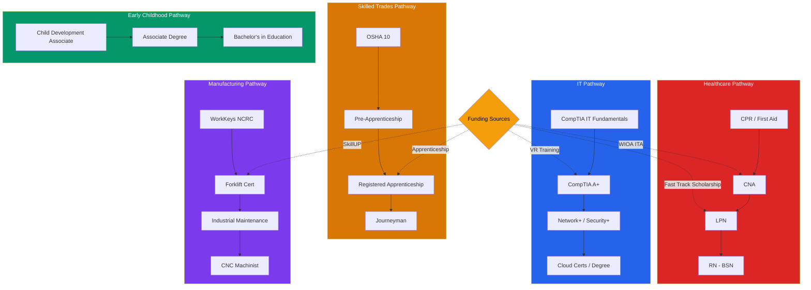

# Missouri Training + Credential Pathways
## Access to Jobs — Module 9
### Source: Missouri WIOA Combined State Plan, PY 2024–2027

---

## STACKABLE CREDENTIAL PATHWAYS

---

## DECISION LOGIC

1. Identify the target role and its Missouri tier (NOW / NEXT / LATER)
2. Identify skill and education gaps
3. Match to shortest credentialing pathway that employers recognize
4. Identify which funding sources the user qualifies for
5. Include timeline estimate

**Guiding principle from Missouri WIOA Plan:**
*"Multiple entry and exit points. Customers can access additional education, training, and
skills until they reach a self-sufficient career."*

---

## PATHWAY BY JOB TIER

### NOW Jobs (short-term — weeks to months)
- WorkKeys National Career Readiness Certificate (NCRC) — available at Job Centers
- Industry certifications: Forklift, OSHA 10, ServSafe, CPR/First Aid, Phlebotomy
- Short-term workforce training through SkillUP or WIOA
- Pre-employment training through employer OJT agreements
- No diploma required for most NOW occupations

### NEXT Jobs (medium-term — 3 months to 2 years)
- Community college certificates (1 semester–1 year)
- Registered Apprenticeship (earn while learning — 1–4 years)
- Technical school credentials: CNA, LPN, HVAC, Electrical, Welding, IT CompTIA
- Integrated Education and Training (IET): AEL + job training simultaneously
- Workforce Diploma (aligned to high-demand careers, employer-recognized Tier 1)

### LATER Jobs (longer-term — 2–4+ years)
- Associate's degree (community college, 2 years)
- Bachelor's degree (4-year college/university)
- Graduate/professional degree
- Note: Missouri lags national average in associate's, bachelor's, and graduate degree attainment
  — increasing credential access is a stated WIOA state plan priority

---

## FUNDING SOURCES — DETAILED

### Fast Track Scholarship
- **Administered by:** Missouri Dept. of Higher Education and Workforce Development (DHEWD)
- **Who qualifies:** Most adult Missourians (broad eligibility)
- **Covers:** Tuition at Missouri community colleges, technical schools, colleges, universities
- **Target:** High-demand fields (Healthcare, IT, Construction, Manufacturing, etc.)
- **Apply:** dhe.mo.gov/fasttrack

### WIOA Individual Training Account (ITA)
- **Who:** WIOA-eligible adults or dislocated workers
- **What:** Funding for Eligible Training Provider (ETP) list programs
- **How:** Administered through local Workforce Development Boards (WDBs) via Job Centers
- **Note:** Consumer Report Cards available for each ETP — ask at Job Center

### SkillUP (SNAP Employment & Training)
- **Who:** SNAP (food stamp) recipients, able-bodied adults
- **What:** Short-term industry-aligned training leading to employment
- **Partners:** Missouri Community Action Network, Community College Association, OWD
- **Access:** DSS offices; opt-in text messages to SNAP households

### Credential Training Fund
- **Who:** Employers (funding passes through to workers)
- **What:** Reimbursement up to $2,000/person; $30,000 max per company per state fiscal year
- **For:** Industry-recognized credentials
- **Route:** Employer must apply; worker benefits indirectly

### Missouri One Start
- **Who:** Businesses expanding or relocating to Missouri; their employees
- **What:** Customized training programs; pre-employment screening and recruitment
- **Partners:** Community colleges and local education agencies
- **Note:** Free to the employer; great for workers at participating companies

### Registered Apprenticeship
- **What:** Earn wages + structured on-the-job training + related instruction = industry credential
- **Administered:** Missouri Office of Apprenticeship and Work-Based Learning (MAT team)
- **Available in:** Construction, Manufacturing, IT, Healthcare, Early Childhood Education
- **Duration:** 1–5 years depending on trade
- **Note:** Intern and Apprentice Tax Credit (IATC) — employers get $1,500 tax credit per apprentice; increases likelihood employers will hire

### HEALS Initiative (Health Education Accelerated Learning & Skills)
- **Who:** Individuals pursuing healthcare occupations
- **Administered by:** DHEWD
- **What:** Aligns training with industry needs; supports accelerated healthcare training models
- **Best for:** CNA, LPN, Medical Assistant, Phlebotomy, and allied health pathways

### Vocational Rehabilitation (MVR / RSB)
- **Who:** Individuals with documented disabilities
- **What:** Full training funding, vocational counseling, job placement, OJT, supported employment
- **Process:** Apply → assessment → Individualized Plan for Employment (IPE)
- **SSDI/SSI:** Benefits counseling available to understand work incentives

### On-the-Job Training (OJT)
- **What:** Employer hired participant; WIOA reimburses up to 50% of wage during training period
- **Available through:** Job Centers / WDBs
- **Best for:** Users who learn by doing; employers who want to train to their standards

### Customized Training
- **What:** Training designed to meet employer specifications; employer pays at least 50% of cost
- **Administered through:** Local WDBs

---

## SPECIAL POPULATIONS — TRAINING NOTES

### Justice-Involved
- DOC vocational programs count as credentials — list on resume
- 967 DOC vocational completions in FY2024
- 1,003 enrolled in postsecondary via CTE/community college partnerships from inside facilities
- DOC has college partnerships with 8 Missouri colleges and universities
- Post-release: OWD staff inside facilities begin job search before release; Job Center staff continues

### Youth (14–24)
- Subsidized employment available through TANF for youth ages 14–24 at ≤185% poverty level
- JAG (Jobs for America's Graduates) — school-based career development
- Excel Center — accredited, tuition-free high school for adults 21+; includes college credits and industry certifications; free drop-in childcare
- Futures Program — employment + education services for foster care youth 16–23

### Veterans
- GI Bill benefits stack with some WIOA services — check with Job Center
- Priority of service for all WIOA programs; DVOP/CODL provide intensive case management
- Registered apprenticeship programs increasingly military-skill aligned

### English Language Learners
- IET (Integrated Education and Training) model: English literacy + occupational training concurrently
- AEL programs required to expose all students to Job Center services at orientation
- LACES tracking system for AEL co-enrollment

---

## STACKABLE CREDENTIALS — RECOMMENDED PROGRESSIONS

**Healthcare pathway (NOW → NEXT → LATER):**
CPR/First Aid → CNA → LPN → RN (with Fast Track or HEALS)

**IT pathway:**
CompTIA IT Fundamentals → CompTIA A+ → Network+ or Security+ → Associate degree → Cloud certs

**Construction / Skilled Trades:**
OSHA 10 → Pre-apprenticeship → Registered Apprenticeship (Electrician / Plumber / HVAC) → Journeyman

**Manufacturing:**
WorkKeys NCRC → Forklift cert → Industrial Maintenance cert → CNC Machinist (CAD) → MSSC CPT

**Early Childhood Education:**
Child Development Associate (CDA) → Associate degree → Bachelor's in Education
(25 registered apprenticeship programs in MO support this pathway)

---

## KEY INSTITUTIONS

- **Missouri community colleges** — Primary fast-track training providers
- **Career and Technical Education (CTE) centers** — Regional; partnerships with DOC and high schools
- **Excel Center** — 4 locations statewide; adults 21+; free; includes childcare
- **Graduation Alliance** — Online; accredited Tier 1 high school diploma + workforce credentials
- **MOLearns** — Virtual AEL platform (statewide online adult basic education)

---

## HOW TO ACCESS TRAINING

1. Go to a **Missouri Job Center** (jobs.mo.gov → Find a Job Center)
2. Register in MoJobs system
3. Meet with a career advisor — they will screen for program eligibility
4. Request referral to appropriate funding stream (ITA, SkillUP, VR, etc.)
5. Choose an Eligible Training Provider from the state-approved list
6. Begin training; maintain contact with Job Center for supportive services
