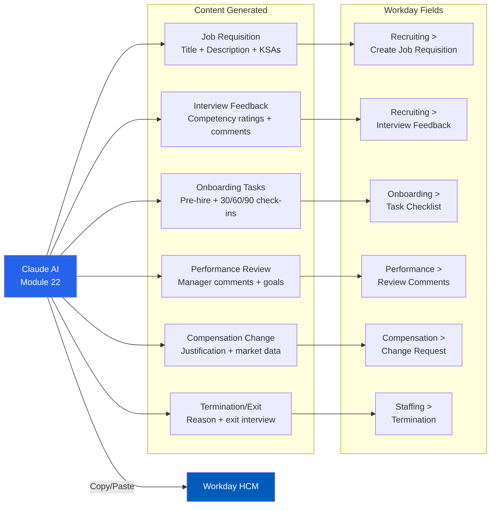

# Workday Integration Workflows
## Access to Jobs — Module 22
### For: HR managers and staff who use Workday HCM for recruitment, onboarding, and talent management

---



---

## PURPOSE

This module generates **copy/paste-ready content** formatted for Workday's standard fields.
When HR staff or managers need to create job requisitions, write job descriptions, build
interview evaluations, document onboarding tasks, or enter performance data in Workday,
this module produces content that drops directly into the platform.

**This module does NOT connect to Workday.** It generates text that you copy and paste
into Workday's fields manually. No API integration or data transfer occurs.

---

## WORKDAY JOB REQUISITION CONTENT

### Create a Job Requisition

When creating a new job requisition in Workday (Recruiting > Create Job Requisition), 
generate content for these fields:

**Field: Job Posting Title** (max ~100 characters)
```
Format: [Job Title] — [Department] — [Location]
Example: "Workforce Development Specialist — Employment Services — St. Charles, MO"
```

**Field: Job Description Summary** (Workday rich text; typically 150–300 words)
```
[2–3 sentences describing the role's purpose and impact]

Key Responsibilities:
• [Duty 1 — action verb + scope]
• [Duty 2 — action verb + scope]
• [Duty 3 — action verb + scope]
• [Duty 4 — action verb + scope]
• [Duty 5 — action verb + scope]

This position reports to the [Supervisor Title] and serves [who/what].
```

**Field: Job Description — Qualifications Section**
```
Minimum Qualifications:
• Education: [Degree level] in [Field] or equivalent combination
• Experience: [X] years of [type]
• [License/certification if required]

Preferred Qualifications:
• [Preferred 1]
• [Preferred 2]
• [Preferred 3]
```

**Field: Additional Job Description** (KSAs for scoring)
```
Knowledge, Skills, and Abilities:
Knowledge of: [area 1]; [area 2]; [area 3]
Skill in: [skill 1]; [skill 2]; [skill 3]
Ability to: [ability 1]; [ability 2]; [ability 3]
```

**Field: Worker Sub-Type** — Select from:
- Regular (full-time permanent)
- Temporary
- Intern
- Contractor

**Field: Job Family / Job Profile** — Match to your organization's Workday job families

**Field: Compensation** — Enter range using data from Module 21 benchmarking

---

## WORKDAY CANDIDATE EVALUATION CONTENT

### Interview Feedback (Recruiting > Interview Feedback)

Workday collects structured feedback per interview. Generate content for:

**Field: Overall Rating** (select from Workday rating scale — typically):
- Strong Yes / Yes / Neutral / No / Strong No

**Field: Comments** (free text — this is where structured evaluation goes)
```
COMPETENCY: [Name]
Question asked: "[Exact question]"
Candidate response summary: [2–3 sentence paraphrase of response]
Rating: [1-5] / [Competency met / partially met / not met]
Observation: [Specific evidence supporting the rating]

COMPETENCY: [Name]
Question asked: "[Exact question]"
Candidate response summary: [2–3 sentence paraphrase]
Rating: [1-5]
Observation: [Specific evidence]

[Repeat for each competency assessed]

OVERALL ASSESSMENT:
Strengths: [Key strengths demonstrated]
Concerns: [Any concerns or gaps]
Recommendation: [Hire / Advance to next round / Do not advance]
Rationale: [1–2 sentences explaining recommendation]
```

**Field: Assessment** (structured ratings if configured)
```
Communication: [1-5]
Technical Skills: [1-5]
Problem Solving: [1-5]
Teamwork: [1-5]
Culture Fit: [1-5]
```

### Candidate Disposition Reason

When declining candidates in Workday, use these standard disposition reasons:

```
APPROPRIATE DISPOSITION REASONS:
- "Position filled by another candidate" (standard; no explanation required)
- "Does not meet minimum qualifications" (factual; documents screening)
- "Qualifications not competitive for this posting" (factual; for after interview)
- "Candidate withdrew" (if candidate declines or stops responding)
- "Position cancelled/on hold" (if req is pulled)

AVOID:
- Reasons that reference protected characteristics
- Vague reasons like "not a good fit" (lacks documentation value)
- Overly detailed reasons (keep it professional and defensible)
```

---

## WORKDAY ONBOARDING TASK CONTENT

### Pre-Hire Tasks (Onboarding > Pre-Hire Checklist)

Generate task descriptions for Workday onboarding workflows:

```
TASK: Complete new hire paperwork
DESCRIPTION: Complete all required new hire forms including I-9, W-4, 
state tax withholding, direct deposit enrollment, emergency contacts, 
and employee handbook acknowledgment. Due by first day of employment.
DUE: Start date
ASSIGNED TO: New hire

TASK: Set up workstation and system access
DESCRIPTION: Request and configure workstation, computer, phone, 
email account, and access to [system names]. Ensure all are operational 
before new hire's first day.
DUE: 2 business days before start date
ASSIGNED TO: IT / Facilities

TASK: Assign onboarding buddy
DESCRIPTION: Identify and confirm a peer mentor for the new hire's 
first 90 days. Brief the buddy on expectations: daily check-ins for 
Week 1, weekly check-ins for Months 1–3.
DUE: 3 business days before start date
ASSIGNED TO: Hiring manager

TASK: Schedule Week 1 orientation meetings
DESCRIPTION: Block the following on the new hire's calendar: 
Day 1 welcome with manager (30 min), team introduction (30 min), 
HR orientation (2 hours), IT systems training (1 hour). 
Schedule 1:1 with hiring manager weekly for first 90 days.
DUE: 1 business day before start date
ASSIGNED TO: Hiring manager / HR

TASK: 30-day check-in
DESCRIPTION: Meet with new hire to assess: task completion, 
relationship building, training progress, questions/concerns. 
Provide one specific piece of positive feedback and one development 
area. Document in Workday.
DUE: Start date + 30 days
ASSIGNED TO: Hiring manager

TASK: 60-day check-in
DESCRIPTION: Assess competence in core duties, contributions beyond 
assigned work, barriers encountered. Discuss 6-month goals and career 
development interests. Document in Workday.
DUE: Start date + 60 days
ASSIGNED TO: Hiring manager

TASK: 90-day probationary review
DESCRIPTION: Formal probationary review. Assess performance against 
position requirements. Determine: complete probation / extend / 
separate. Set annual performance goals. Document decision in Workday.
DUE: Start date + 90 days
ASSIGNED TO: Hiring manager + HR
```

---

## WORKDAY PERFORMANCE CONTENT

### Performance Review Comments

Generate structured manager comments for Workday performance reviews:

**Field: Overall Manager Comment** (Goals tab or Overall section)
```
[Employee Name] has [exceeded / met / partially met / not met] 
expectations during the [review period].

Key accomplishments this period:
• [Accomplishment 1 with quantified result]
• [Accomplishment 2 with quantified result]
• [Accomplishment 3 with quantified result]

Areas of strength:
• [Strength 1 — with specific example]
• [Strength 2 — with specific example]

Development opportunities:
• [Area 1 — specific action to take in next period]
• [Area 2 — specific action or training]

Goals for next review period:
1. [SMART goal 1: Specific, Measurable, Achievable, Relevant, Time-bound]
2. [SMART goal 2]
3. [SMART goal 3]
```

**Field: Competency Rating Comments** (per-competency)
```
[Competency Name]: [Rating]
[Employee] demonstrated [competency] through [specific example]. 
[Quantified result if applicable]. This represents [improvement / 
consistent performance / an area for continued development] compared 
to the prior review period.
```

### Goal Creation

For Workday goal entries (Performance > Goals):

**Field: Goal** (title — keep under 80 characters)
```
Format: [Action verb] + [what] + [by when/to what level]
Example: "Increase WIOA participant placement rate to 75% by Q4 2026"
```

**Field: Description** (supporting detail)
```
Success criteria: [What specifically constitutes meeting this goal]
Measurement: [How progress will be tracked — system, report, metric]
Resources needed: [Training, tools, support, budget]
Milestones:
  - [Month 1]: [Milestone]
  - [Month 3]: [Milestone]
  - [Month 6]: [Final target]
```

---

## WORKDAY COMPENSATION CONTENT

### Compensation Change Justification

For Workday compensation changes (Compensation > Request Compensation Change):

**Field: Reason / Comments**
```
JUSTIFICATION FOR [Merit increase / Equity adjustment / Promotion / Market adjustment]:

Current salary: $[amount] | Compa-ratio: [X.XX]
Proposed salary: $[amount] | New compa-ratio: [X.XX]
Increase: [X.X%] | Dollar amount: $[amount]

Justification:
[2–3 sentences explaining why. Include: performance level, market data, 
internal equity comparison, retention risk, or new responsibilities.]

Supporting data:
• Performance rating: [rating] ([X] consecutive review periods at this level)
• Market benchmark: $[amount] (source: [BLS / SHRM / internal survey])
• Internal equity: Current salary is [above/below/at] peer average of $[amount]
• [If promotion: New responsibilities include [list key new duties]]
```

---

## WORKDAY JOB CHANGE / TRANSFER CONTENT

### Position Change Justification

For Workday business process: Change Job

**Field: Reason / Comments**
```
POSITION CHANGE: [Transfer / Promotion / Lateral / Reorganization]

From: [Current Title] — [Current Department]
To: [New Title] — [New Department]
Effective date: [Date]

Business justification:
[2–3 sentences. Why is this change needed? What business need does it address?
How does it benefit the employee and the organization?]

Impact:
• Backfill needed for current role: [Yes/No]
• Training needed for new role: [Yes/No — describe]
• Compensation change: [Yes/No — if yes, see compensation justification]
```

---

## WORKDAY TERMINATION / EXIT CONTENT

### Separation Documentation

For Workday termination workflow:

**Field: Termination Reason** — Use standard Workday categories:
```
Voluntary:
- "Resignation — new opportunity"
- "Resignation — relocation"
- "Resignation — return to school"
- "Resignation — personal reasons"
- "Retirement"

Involuntary:
- "Performance — failure to meet standards"
- "Conduct — policy violation"
- "Position elimination"
- "End of temporary assignment"
- "Probationary separation"
```

**Field: Exit Interview Summary** (if applicable)
```
EXIT INTERVIEW SUMMARY — [Employee Name] — [Date]
Position: [Title] | Department: [Department]
Tenure: [X years, X months]
Last performance rating: [Rating]

Reason for leaving: [In employee's words]

Satisfaction areas:
• [What they valued about the organization]
• [What worked well]

Dissatisfaction areas:
• [What contributed to their decision to leave]
• [Suggestions for improvement]

Would they recommend this workplace to others? [Yes/No/Maybe]
Would they consider returning in the future? [Yes/No/Maybe]

Actionable feedback for manager/department:
• [Specific action item 1]
• [Specific action item 2]

Exit interview conducted by: [Name/Title]
```

---

## COPY/PASTE WORKFLOW GUIDE

### How to Use This Module with Workday

1. **Tell the AI what you need:** "I need to create a job requisition in Workday for a Case Manager"
2. **The AI generates field-by-field content** formatted for Workday's standard fields
3. **Copy each section** and paste directly into the corresponding Workday field
4. **Review and adjust** — always verify content matches your organization's Workday configuration
5. **Submit** through your normal Workday workflow

### Field Length Limits (Common Workday Defaults)

| Workday Field | Typical Max Length | Best Practice |
|---|---|---|
| Job Posting Title | 100 characters | Keep under 80 for readability |
| Job Description Summary | 4,000 characters | 150–300 words; use bullet points |
| Interview Comments | 4,000 characters | Structure by competency |
| Performance Comments | 4,000 characters | Start with summary, then details |
| Goal Title | 100 characters | Action verb + what + target |
| Goal Description | 2,000 characters | Include SMART criteria |
| Compensation Justification | 2,000 characters | Lead with data, not opinion |
| Termination Comments | 2,000 characters | Factual, professional, defensible |

### Tips for Workday Content

- **Use plain text** — Workday rich text editors may strip formatting; use dashes for bullets
- **Keep each competency separate** — Workday often has per-competency comment fields
- **Match your org's rating scale** — Verify your Workday instance uses 1–5, or another scale
- **Include dates** — Workday tracks timelines; include target dates in goals and tasks
- **Use consistent language** — Match the competency names configured in your Workday tenant
