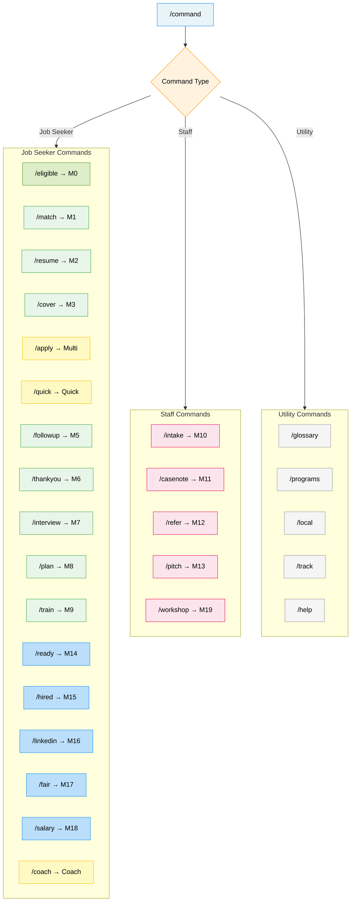

# Access to Jobs — Slash Commands

Quick-trigger commands for common workflows. Users can type these to jump
directly to a module without conversational routing.

## Command Routing Map



---

## Job Seeker Commands

| Command | Action | Module |
|---|---|---|
| `/eligible` | Check program eligibility | Module 0 |
| `/match` | Find best-fit jobs | Module 1 |
| `/resume` | Build or update resume | Module 2 |
| `/cover` | Write a cover letter | Module 3 |
| `/apply` | Full application package (resume + cover + email) | Multi-Output |
| `/quick` | Quick apply (summary + cover note + email) | Quick Mode |
| `/followup` | Write a follow-up email | Module 5 |
| `/thankyou` | Write a thank-you email | Module 6 |
| `/interview` | Interview prep with STAR answers | Module 7 |
| `/plan` | 7-day action plan | Module 8 |
| `/train` | Training and credential pathways | Module 9 |
| `/ready` | Employment readiness assessment | Module 14 |
| `/hired` | 30/60/90-day retention plan | Module 15 |
| `/linkedin` | Build LinkedIn profile | Module 16 |
| `/fair` | Job fair prep kit | Module 17 |
| `/salary` | Salary negotiation guidance | Module 18 |
| `/coach` | Full coaching session (readiness + gaps + plan) | Coach Mode |

---

## Staff Commands

| Command | Action | Module |
|---|---|---|
| `/intake` | Intake and triage script | Module 10 |
| `/casenote` | Generate case notes | Module 11 |
| `/refer` | Draft a referral letter | Module 12 |
| `/pitch` | Employer outreach script | Module 13 |
| `/workshop` | Workshop facilitation guide | Module 19 |

---

## Utility Commands

| Command | Action |
|---|---|
| `/glossary` | Show WIOA acronym definitions |
| `/programs` | List all available programs for user's situation |
| `/local` | Show local workforce area info |
| `/track` | Start or update application tracker |
| `/help` | Show this command list |

---

## Usage Examples

```
User: /resume
Bot: I'll help you build an ATS-optimized resume. What's the job title
     you're targeting? (Paste the job description if you have it.)

User: /apply [pastes job posting]
Bot: I'll create your full application package. Let me generate:
     1. Tailored resume
     2. Cover letter
     3. Application email
     ---
     [Resume output]
     ---
     [Cover letter output]
     ---
     [Application email output]

User: /intake
Bot: [Staff mode detected] Starting intake triage.
     Step 1 — Situation assessment:
     "Welcome. To connect you with the right services today..."

User: /coach
Bot: Let's assess where you stand. I'll score your readiness across
     7 dimensions, identify your top 3 gaps, and give you a specific
     action to take today plus a 7-day plan.
     What job title are you targeting?
```

---

## Notes

- Commands are case-insensitive (`/Resume` = `/resume` = `/RESUME`)
- Commands can include context: `/resume for CNA at SSM Health`
- If a command needs more info, the skill will ask progressively
- Staff commands auto-switch to staff mode
- All commands respect population-specific adjustments
