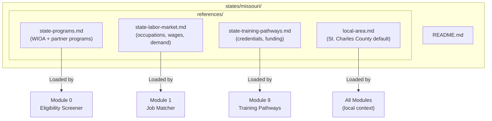
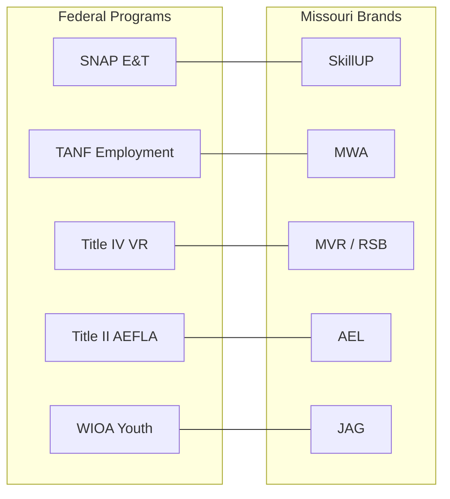
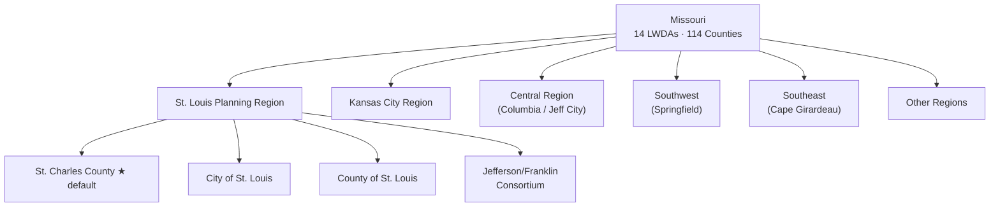
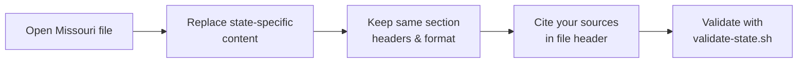

# Missouri Reference Implementation

This directory contains the Missouri-specific reference files that ship as the
default implementation of Access to Jobs. Missouri was the first state deployed
and serves as the template for all other state deployments.

---

## Architecture

### File Structure

### Missouri Programs Crosswalk

### Missouri Regions

### Template Reuse Flow

---

## Data Sources

| File | Source | Vintage |
|---|---|---|
| `state-programs.md` | Missouri WIOA Combined State Plan, PY 2024–2027 | January 2026 |
| `state-labor-market.md` | MERIC / BLS / Lightcast | 2024 annual data |
| `state-training-pathways.md` | Missouri WIOA State Plan + DHEWD | PY 2024–2027 |
| `local-area.md` | St. Charles County LWDA (default) | 2024 local data |

---

## Missouri-Specific Programs

| Program | Missouri Brand | Federal Equivalent |
|---|---|---|
| SNAP E&T | SkillUP | SNAP Employment & Training |
| TANF work program | Missouri Work Assistance (MWA) | TANF Employment Services |
| State job board | jobs.mo.gov / MoJobs | America's Job Center Online |
| Vocational Rehabilitation | MVR (Missouri Vocational Rehabilitation) | Title IV VR |
| Blind services | RSB (Rehabilitation Services for the Blind) | Title IV VR |
| Adult Education | AEL (Adult Education and Literacy) | Title II AEFLA |
| Youth career program | JAG (Jobs for America's Graduates) | Varies by state |
| Veteran OJT | Show-Me Heroes | State-specific |
| Healthcare training | HEALS Initiative | State-specific |
| Scholarship program | Fast Track Scholarship | State-specific |
| Credential fund | Credential Training Fund | State-specific |
| Employer training | Missouri One Start | State-specific |
| State workforce agency | OWD (Office of Workforce Development) | State workforce agency |
| State LMI agency | MERIC | State LMI agency |

---

## Missouri Regions

Missouri has 14 Local Workforce Development Areas (LWDAs) organized into
planning regions. The `local-area.md` file can be configured for any LWDA.

**Default:** St. Charles County (standalone LWDA, St. Louis planning region)

**Other LWDAs include:**
- City of St. Louis
- County of St. Louis
- Jefferson/Franklin Consortium
- Kansas City region
- Central region (Columbia/Jefferson City)
- Southwest (Springfield)
- Southeast (Cape Girardeau)
- And others covering all 114 counties

---

## How to Use Missouri as a Template

When deploying to a new state, use each Missouri file as a structural template:

1. Open the Missouri file
2. Replace Missouri-specific content with your state's equivalent
3. Keep the same section headers and format
4. Cite your sources in the file header

The Missouri files are intentionally over-documented to make it clear what
content goes where. Your state files don't need to be as long — cover the
key programs, top occupations, and primary access points.

---

## Maintained By

Doug Devitre · CoTrackPro
dougdevitre@gmail.com
