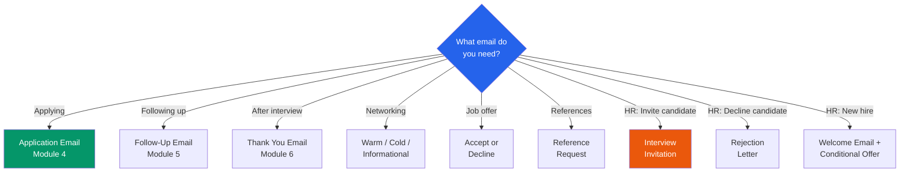

# Email Templates

Ready-to-customize email templates for job seeker and staff workflows.



---

## JOB SEEKER EMAILS

### Networking Introduction (warm contact)

```
Subject: Connecting about [Industry/Role] opportunities

Hi [Name],

I hope you're doing well. I'm currently exploring [industry/role type]
opportunities in [area] and thought of you because [specific connection —
former colleague, mutual contact, same industry].

I'd love to hear about your experience at [Company] and any advice you
might have for someone making this transition. Would you have 15 minutes
for a quick call or coffee this week?

Thank you,
[Name] | [Phone]
```

### Networking Introduction (cold / LinkedIn)

```
Subject: [Shared connection or interest] — Quick question about [Industry]

Hi [Name],

I came across your profile while researching [specific topic] and was
impressed by your work in [specific area]. I'm currently [brief situation]
and exploring opportunities in [field].

Would you be open to a brief conversation about your experience in
[specific area]? I'd appreciate any insights.

Best,
[Name]
```

### Informational Interview Request

```
Subject: Request for 15-minute informational conversation — [Your Field]

Dear [Name],

I'm exploring career opportunities in [field] and your background in
[specific area] caught my attention. I'm not reaching out about a specific
job — I'd simply value your perspective on [1-2 specific questions].

Would you have 15 minutes this week or next for a brief phone call?
I'm happy to work around your schedule.

Thank you for considering,
[Name] | [Phone] | [LinkedIn URL]
```

### Post-Networking Follow-Up

```
Subject: Thank you for the conversation — [Name]

Hi [Name],

Thank you for taking the time to speak with me about [topic]. Your insight
about [specific takeaway] was especially helpful. I'm going to [specific
action you'll take based on their advice].

I'll keep you posted on my progress. If there's anything I can do to
return the favor, please don't hesitate to ask.

Best,
[Name]
```

### Job Fair Follow-Up

```
Subject: Great speaking with you at [Event Name] — [Name]

Dear [Recruiter Name],

It was a pleasure speaking with you about [Company]'s opportunities at
[Event] today. Our conversation about [specific detail] reinforced my
interest in [role/area].

I've attached my resume and will also be applying through [Company's
website/system]. Thank you again for your time — I look forward to
staying in touch.

Best,
[Name] | [Phone] | [Email] | [LinkedIn URL]
```

### Accepting a Job Offer

```
Subject: Acceptance — [Job Title] — [Name]

Dear [Hiring Manager],

Thank you for offering me the [Job Title] position at [Company]. I'm
pleased to accept under the terms outlined in your offer letter dated
[date], including [start date, salary, and any negotiated terms].

I'm excited to join the team and contribute to [specific area]. Please
let me know if there's anything I should prepare before my start date.

Sincerely,
[Name]
```

### Declining a Job Offer (professional)

```
Subject: Re: [Job Title] Offer — [Name]

Dear [Hiring Manager],

Thank you for offering me the [Job Title] position at [Company]. After
careful consideration, I've decided to pursue a different opportunity
that more closely aligns with my career goals at this time.

I have great respect for [Company] and the team I met during the
interview process. I hope our paths may cross again in the future.

Best regards,
[Name]
```

### Requesting a Reference

```
Subject: Would you be willing to serve as a reference?

Hi [Name],

I'm currently applying for [type of role] positions and was hoping you
might be willing to serve as a professional reference. You saw my work
firsthand when we [specific shared experience], and I think you could
speak to my [specific strengths].

If you're comfortable, I'd provide your name and contact information
to prospective employers. I'd also be happy to share the specific roles
I'm applying for so you have context.

Thank you for considering,
[Name] | [Phone]
```

---

## STAFF EMAILS

### Participant Appointment Reminder

```
Subject: Upcoming appointment — [Date] at [Time]

Hi [First Name],

This is a reminder about your appointment at the [Job Center Name]
on [Date] at [Time].

Please bring:
- [Item 1 — e.g., photo ID]
- [Item 2 — e.g., resume if you have one]
- [Item 3 — e.g., any job postings you're interested in]

If you need to reschedule, please call [Phone] or reply to this email.

We look forward to seeing you,
[Staff Name]
[Job Center Name]
```

### Employer Introduction

```
Subject: Workforce partnership opportunity — [Job Center Name]

Dear [Employer Contact],

I'm [Name] with the [Job Center Name]. We work with local employers to
connect them with qualified candidates and offset hiring and training costs
through state and federal workforce programs.

I'd like to share three specific ways we can help [Company]:
1. Pre-screened candidates matched to your open positions
2. On-the-Job Training (OJT) — we reimburse up to [50-90%] of wages
   during the training period
3. Tax credits (WOTC) worth $2,400–$9,600 per eligible hire

Could we schedule a 20-minute conversation to see if there's a fit?
I'm happy to come to you.

Best,
[Staff Name] | [Title]
[Job Center Name]
[Phone] | [Email]
```

### Partner Agency Coordination

```
Subject: Co-enrollment coordination — [First Name Last Initial]

Hi [Partner Name],

I'm reaching out regarding [First Name], who is currently enrolled in
[Program] through our Job Center. [He/She/They] would benefit from
co-enrollment in [Partner Program] for [specific reason].

Could we schedule a brief call to coordinate services and avoid
duplication? I'm available [suggest times].

Thank you,
[Staff Name] | [Title]
[Job Center Name]
```

---

## HR MANAGER / EMPLOYER EMAILS

### Interview Invitation to Candidate

```
Subject: Interview Invitation — [Position Title] — [Organization Name]

Dear [Candidate Name],

Thank you for your application for the [Position Title] position with
[Organization Name]. We are pleased to invite you to interview.

Date: [Day, Date]
Time: [Time including time zone]
Location: [Full address OR video link]
Format: [Panel interview / One-on-one / Virtual]
Estimated duration: [XX minutes]

Please bring:
- A government-issued photo ID
- [Any additional documents: transcripts, certifications, portfolio]

Parking/access: [Instructions]

If you require any accommodations for the interview, please let me
know in advance and we will be happy to arrange them.

Please confirm your attendance by replying to this email by [date].
If none of the above times work for your schedule, please contact me
to arrange an alternative.

Best regards,
[HR Contact Name] | [Title]
[Organization Name]
[Phone] | [Email]
```

### Interview Reminder (24 Hours Before)

```
Subject: Reminder — Interview Tomorrow for [Position Title]

Dear [Candidate Name],

This is a friendly reminder about your interview tomorrow:

Date: [Day, Date]
Time: [Time]
Location: [Address or video link]
Contact upon arrival: [Name and phone number]

We look forward to meeting you.

Best,
[HR Contact Name]
[Phone]
```

### Rejection Letter — Non-Selected Candidate

```
Subject: Application Update — [Position Title] — [Organization Name]

Dear [Candidate Name],

Thank you for your interest in the [Position Title] position with
[Organization Name] and for the time you invested in the application
[and interview] process.

After careful consideration, we have selected another candidate whose
qualifications most closely match our current needs. This was a
competitive process and your candidacy was given thorough review.

We encourage you to apply for future openings that match your
qualifications. [Open positions are posted at [URL].]

We wish you the best in your career.

Sincerely,
[HR Contact Name] | [Title]
[Organization Name]
```

### Reference Check Request

```
Subject: Employment Reference Request — [Candidate Name] for [Position Title]

Dear [Reference Name],

[Candidate Name] has applied for the position of [Position Title] with
[Organization Name] and listed you as a professional reference.

If you are willing, I would appreciate your feedback on the following:

1. In what capacity and for how long did you work with [Candidate]?
2. What were their primary responsibilities?
3. How would you rate their [key competency from the position — e.g.,
   attention to detail, teamwork, reliability]?
4. Can you describe a situation where they demonstrated [relevant skill]?
5. Would you rehire or recommend this person?

You may respond by email or phone. I am available at [phone] during
[hours]. I would appreciate a response by [date] if possible.

This information will be kept confidential and used solely for
employment evaluation purposes.

Thank you,
[HR Contact Name] | [Title]
[Organization Name]
[Phone] | [Email]
```

### Welcome Email to New Hire

```
Subject: Welcome to [Organization Name] — [New Hire Name]

Dear [Name],

Welcome to [Organization Name]! We are excited to have you join our
team as [Position Title] starting [Start Date].

Here's what to expect on your first day:

Arrival time: [Time]
Location: [Address + specific entrance/floor/room]
Who to ask for: [Supervisor or HR contact name]
What to bring: [Photo ID, signed offer letter, direct deposit info, etc.]
Dress code: [Business professional / business casual / other]

During your first week, you will:
- Complete new hire orientation and required paperwork
- Meet your team and key colleagues
- Set up your workstation and system access
- Begin your onboarding training plan

Your supervisor, [Name], is looking forward to working with you.
If you have any questions before your start date, don't hesitate to
reach out to me at [phone/email].

Welcome aboard!

[HR Contact Name] | [Title]
[Organization Name]
[Phone] | [Email]
```

### Conditional Offer with Background Check Notice

```
Subject: Conditional Offer of Employment — [Position Title]

Dear [Candidate Name],

I am pleased to extend a conditional offer of employment for the
position of [Position Title] with [Organization Name].

Position: [Title]
Department: [Department]
Start date: [Proposed date, contingent on clearance]
Salary: $[Amount] [per year / per hour]
Reports to: [Supervisor name/title]

This offer is contingent upon satisfactory completion of:
- [ ] Background investigation
- [ ] [Drug screening, if applicable]
- [ ] [Reference verification]
- [ ] [Education/credential verification]
- [ ] [Security clearance, if applicable]

Next steps:
1. Sign and return the attached offer letter by [date]
2. Complete the enclosed background check authorization form
3. [Any additional steps]

The background check process typically takes [X–X weeks]. We will
notify you promptly upon completion.

If you have any questions about the offer or the process, please
contact me at [phone/email].

Congratulations,
[HR Contact Name] | [Title]
[Organization Name]
[Phone] | [Email]
```
