# Output Templates

Ready-to-use output structures for each module. These templates define the exact
format Claude should produce. They are referenced by SKILL.md modules.

## Template Overview

```mermaid
flowchart TD
    TEMPLATES["Output Templates"]:::root --> DOC["Document Templates"]:::doc
    TEMPLATES --> EMAIL["Email Templates"]:::email
    TEMPLATES --> ASSESS["Assessment Templates"]:::assess
    TEMPLATES --> STAFF["Staff Templates"]:::staff

    DOC --> D1["Resume\nModule 2"]:::mod
    DOC --> D2["Cover Letter\nModule 3"]:::mod
    DOC --> D3["LinkedIn Profile\nModule 16"]:::mod

    EMAIL --> E1["Application Email\nModule 4"]:::mod
    EMAIL --> E2["Follow-Up Email\nModule 5"]:::mod
    EMAIL --> E3["Thank You Email\nModule 6"]:::mod

    ASSESS --> A1["Interview Prep\nModule 7 · 5 Qs + STAR"]:::mod
    ASSESS --> A2["Readiness Scorecard\nModule 14 · 7 dimensions"]:::mod
    ASSESS --> A3["Application Tracker\nModule 8 · CSV export"]:::mod

    STAFF --> S1["Case Note\nModule 11"]:::mod
    STAFF --> S2["Referral Letter\nModule 12"]:::mod

    classDef root fill:#e8f4f8,stroke:#2196F3,color:#000
    classDef doc fill:#e8f5e9,stroke:#4CAF50,color:#000
    classDef email fill:#fff9c4,stroke:#FFC107,color:#000
    classDef assess fill:#bbdefb,stroke:#2196F3,color:#000
    classDef staff fill:#fce4ec,stroke:#E91E63,color:#000
    classDef mod fill:#f5f5f5,stroke:#9E9E9E,color:#000
```



---

## TEMPLATE: Resume (Module 2)

```
[FIRST LAST NAME]
[City, State] | [Phone] | [Email] | [LinkedIn URL if provided]

─────────────────────────────────────────────────
PROFESSIONAL SUMMARY
─────────────────────────────────────────────────
[2–3 sentences. Lead with years of experience and role type.
Include 2–3 top skills that match the JD. End with value delivered.]

─────────────────────────────────────────────────
CORE SKILLS
─────────────────────────────────────────────────
[Skill 1] | [Skill 2] | [Skill 3] | [Skill 4] | [Skill 5]
[Skill 6] | [Skill 7] | [Skill 8] | [Skill 9] | [Skill 10]

─────────────────────────────────────────────────
PROFESSIONAL EXPERIENCE
─────────────────────────────────────────────────
[Job Title] | [Employer Name] | [City, State] | [MM/YYYY – MM/YYYY or Present]
• [Action verb + task + result/impact. Quantify if possible.]
• [Action verb + task + result/impact.]
• [Action verb + task + result/impact.]

[Repeat for each position — most recent first]

─────────────────────────────────────────────────
EDUCATION
─────────────────────────────────────────────────
[Degree or Certificate] — [Institution Name] | [City, State] | [Year]

─────────────────────────────────────────────────
CERTIFICATIONS (if applicable)
─────────────────────────────────────────────────
• [Certification Name] — [Issuing Body] | [Year]

─────────────────────────────────────────────────
VOLUNTEER / COMMUNITY (optional)
─────────────────────────────────────────────────
• [Role] — [Organization] | [Year]
```

---

## TEMPLATE: Cover Letter (Module 3)

```
[Date]

[Hiring Manager Name or "Hiring Team"]
[Company Name]
[Company Address if known]

Re: Application for [Job Title]

Dear [Hiring Manager Name / Hiring Team],

[HOOK: 1–2 sentences connecting to company + role.]

[PROOF: 2–3 accomplishments matched to JD. Quantify. Mirror JD keywords.]

[FIT: Why this company. Connect their mission to your background.]

I would welcome the opportunity to discuss how my experience can contribute
to [Company Name]. Thank you for your time and consideration.

Sincerely,

[Full Name]
[Phone] | [Email]
```

---

## TEMPLATE: Application Email (Module 4)

```
Subject: Application for [Job Title] — [Name]

Dear Hiring Team / [Manager Name],

I am writing to express my interest in the [Job Title] position
[at Company / as posted on Source]. [1 sentence value prop matched to role.]

Please find my resume and cover letter attached. I look forward to discussing
how my background can contribute to your team.

Sincerely,
[Name] | [Phone] | [Email]
```

---

## TEMPLATE: Follow-Up Email (Module 5)

```
Subject: Following Up — [Job Title] Application — [Name]

Dear [Hiring Manager / Hiring Team],

I submitted my application for [Job Title] on [Date] and wanted to follow up
on its status. I remain very interested in this opportunity and would welcome
the chance to discuss my qualifications further. Thank you for your time.

Best regards,
[Name] | [Phone]
```

---

## TEMPLATE: Thank You Email (Module 6)

```
Subject: Thank You — [Job Title] Interview — [Name]

Dear [Interviewer Name(s)],

Thank you for meeting with me about the [Job Title] role. I especially
appreciated [specific topic from the interview — 1 sentence]. Our conversation
reinforced my enthusiasm for [Company] and my confidence that [key strength]
would allow me to contribute meaningfully.

I look forward to the next steps.

Sincerely,
[Name] | [Phone] | [Email]
```

---

## TEMPLATE: Interview Prep (Module 7)

```
## Interview Prep: [Job Title]

**Q1: [Question]**
Why they ask: ...
STAR Answer:
  Situation: ...
  Task: ...
  Action: ...
  Result: ...

**Q2: [Question]**
[repeat STAR format]

**Q3: [Question]**
[repeat STAR format]

**Q4: [Question]**
[repeat STAR format]

**Q5: [Question]**
[repeat STAR format]

## Coaching Tips
- [Role-specific tip 1]
- [Tip 2]
- [Common mistake to avoid for this role type]

## Questions to Ask the Interviewer
1. What does success look like in this role in the first 90 days?
2. [Role-specific question]
3. What's the team culture like?
```

---

## TEMPLATE: Readiness Assessment (Module 14)

```
## Employment Readiness Assessment
### Target: [Job Title] | Date: [Today]

SCORE CARD (1 = needs work, 5 = strong)

[ ] Resume ............ [1-5] — [1-sentence diagnosis]
[ ] Cover letter ...... [1-5] — [1-sentence diagnosis]
[ ] Skills match ...... [1-5] — [1-sentence diagnosis]
[ ] Application volume . [1-5] — [1-sentence diagnosis]
[ ] Interview prep .... [1-5] — [1-sentence diagnosis]
[ ] Program enrollment . [1-5] — [1-sentence diagnosis]
[ ] Online presence ... [1-5] — [1-sentence diagnosis]

OVERALL: [total / 35] — [Needs foundation / Building momentum / Competitive / Job-ready]

TOP 3 GAPS TO CLOSE:
1. [Gap] → [Specific action this week]
2. [Gap] → [Specific action this week]
3. [Gap] → [Specific action this week]

YOUR SINGLE NEXT ACTION (do this today):
→ [One concrete, specific task]

ESTIMATED TIME TO COMPETITIVE:
[ ] Under 2 weeks  [ ] 2–4 weeks  [ ] 1–2 months  [ ] 2+ months
```

---

## TEMPLATE: Case Note (Module 11)

```
SERVICE NOTE — [Date]
Service Type: [Career Service / Training Service / Support Service / Referral]
Staff: [Name/Title]
Participant: [First name or ID only — no SSN or full PII]

Summary:
Participant met with staff for [service type]. [1–2 sentences describing situation.]

Services Provided:
- [Specific service 1]
- [Specific service 2]

Referrals Made:
- [Program/agency] — [reason]

Participant Action Items:
- [What the participant agreed to do]
- By: [date]

Staff Follow-Up:
- [What staff will do next]
- By: [date]

Outcome/Progress Notes:
[Brief note on progress toward employment goal / barriers / next steps]
```

---

## TEMPLATE: Referral Letter (Module 12)

```
[Date]

[Receiving Agency Name]
[Agency Address if known]

Re: Workforce Referral — [First Name Last Initial]

Dear [Program Coordinator / Case Manager / Intake Staff]:

I am writing to refer [First Name] to [Program Name] for [specific service].
[First Name] is currently enrolled in / seeking services through the
[Local American Job Center Name].

Relevant background:
[1–2 sentences — no sensitive PII]

Areas where your program can assist:
- [Specific need 1]
- [Specific need 2]

[First Name] has consented to this referral and is aware to expect contact
from your office. Please feel free to contact me with any questions.

Sincerely,
[Staff Name]
[Title]
[American Job Center Name]
[Phone] | [Email]
```

---

## TEMPLATE: Application Tracker (CSV)

```csv
Date,Company,Job Title,Source,Contact,Submitted,Followed Up,Interview,Thank You,Status,Fit,Notes
2026-03-31,SSM Health,CNA,jobs.mo.gov,HR Dept,Yes,No,,,submitted,high,Night shift available
2026-03-30,Amazon,Warehouse Associate,Indeed,,,,,,,drafting,medium,Fulfillment center O'Fallon
```

---

## TEMPLATE: LinkedIn Headline

```
Formula: [What you do] + [Who you help or Where] + [Result/Specialty]

Examples:
"CNA | Compassionate Patient Care | 3+ Years in Long-Term Care"
"Warehouse Operations | Forklift Certified | Seeking St. Louis Opportunities"
"Transitioning Veteran | Logistics & Supply Chain | DOD TS/SCI Clearance"
"Manufacturing Professional | Quality Control & OSHA 10 | 8 Years Experience"

NOT: "Looking for opportunities" or "Unemployed" or "Open to work" (as headline)
```
