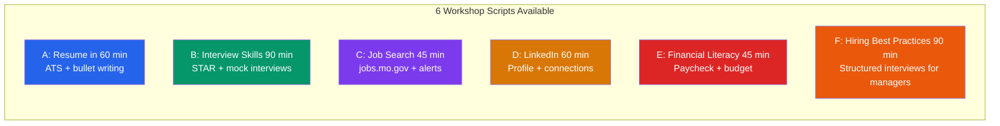

# Workshop Templates

Turnkey facilitation scripts for Job Center staff running group workshops.



---

## WORKSHOP A: Resume in 60 Minutes

**Audience:** 8–20 job seekers
**Materials:** Whiteboard/projector, printed handouts, sample job posting
**Pre-work:** None required

### Agenda

| Time | Section | Activity |
|---|---|---|
| 0:00–0:05 | Welcome | Introductions, parking lot, ground rules |
| 0:05–0:15 | ATS Reality | Why resumes get filtered before humans see them |
| 0:15–0:30 | 5 Sections | Professional Summary, Skills, Experience, Education, Certs |
| 0:30–0:45 | Live Exercise | Rewrite one bullet point together |
| 0:45–0:55 | Common Mistakes | Top 5 mistakes and quick fixes |
| 0:55–1:00 | Q&A + Next Steps | Schedule 1-on-1 resume reviews |

### Key Talking Points

**ATS section (0:05):**
"Most resumes are never read by a human first. They go through software
called Applicant Tracking Systems that scan for keywords. If your resume
doesn't have the exact words from the job posting, it gets filtered out
before anyone sees it. Today we're going to fix that."

**Experience section (0:15):**
"The #1 mistake: listing duties instead of results. 'Responsible for
customer service' tells me nothing. 'Resolved 40+ customer complaints
per week with 95% satisfaction score' tells me everything. See the
difference? One is a job description. The other is proof you're good."

**Live exercise (0:30):**
Put a weak bullet on the whiteboard. Workshop it as a group.
- Weak: "Responsible for stocking shelves"
- Better: "Stocked and organized 500+ products daily, maintaining 98% planogram accuracy"

### Handout Content
- Resume template (from templates/output-templates.md)
- Action verb bank (from references/resume-template.md)
- ATS keyword checklist: "Did you mirror 5+ keywords from the job posting?"

---

## WORKSHOP B: Interview Skills (90 Minutes)

**Audience:** 8–15 job seekers
**Materials:** Printed question cards, timer, chairs arranged in pairs
**Pre-work:** Participants should bring a target job title

### Agenda

| Time | Section | Activity |
|---|---|---|
| 0:00–0:10 | Four Types of Questions | Behavioral, situational, technical, conversational |
| 0:10–0:30 | STAR Method | Teach + practice one example together |
| 0:30–0:45 | The 5 Universal Questions | Tell me about yourself, strengths, weaknesses, why here, where in 5 years |
| 0:45–1:15 | Mock Interview Pairs | 15 min each direction, facilitator circulates |
| 1:15–1:25 | After the Interview | Thank-you email, follow-up timeline, what if you don't hear back |
| 1:25–1:30 | Q&A | |

### Key Talking Points

**Opening (0:00):**
"Employers aren't just evaluating your skills. They're evaluating: Can I
trust this person? Will they show up? Will they represent us well? Your
job in the interview is to answer those questions before they even ask them."

**STAR Method (0:10):**
"Every behavioral question can be answered with STAR:
- Situation: Set the scene in 1 sentence
- Task: What was your responsibility?
- Action: What did YOU do? (Not your team — you)
- Result: What happened? Numbers are gold."

**Mock interview instructions (0:45):**
"Pair up. One person interviews, one answers. Use the question cards.
After each answer, give one piece of positive feedback and one suggestion.
Switch after 15 minutes. I'll be walking around to listen and coach."

### Question Cards (print and cut)
```
Tell me about yourself.
---
What's your greatest strength?
---
Tell me about a time you had a conflict with a coworker.
---
Why do you want to work here?
---
Tell me about a time you went above and beyond.
---
What's a mistake you made and what did you learn?
---
Where do you see yourself in 5 years?
---
Why should we hire you?
---
Tell me about a time you had to learn something quickly.
---
Do you have any questions for me?
```

---

## WORKSHOP C: Job Search Fundamentals (45 Minutes)

**Audience:** 10–25 job seekers (beginner level)
**Materials:** Computer lab or projector, printed quick-start guide

### Agenda

| Time | Section | Activity |
|---|---|---|
| 0:00–0:10 | Account Setup | Register on state job board |
| 0:10–0:20 | Resume Upload | Upload and keyword-optimize |
| 0:20–0:30 | Job Search | Search, filter, save jobs |
| 0:30–0:35 | Job Alerts | Set up automated alerts |
| 0:35–0:45 | Job Center Services | What else is available + scheduling |

### Facilitator Notes
- Walk the room during account setup — many participants will need help
- Have pre-printed login credential sheets for participants to keep
- Demonstrate each step on projector before asking participants to do it
- Have a co-facilitator if group is >15

---

## WORKSHOP D: LinkedIn for Job Seekers (60 Minutes)

**Audience:** 8–15 job seekers
**Materials:** Computer lab, projector

### Agenda

| Time | Section | Activity |
|---|---|---|
| 0:00–0:10 | Why LinkedIn | 87% of recruiters use LinkedIn |
| 0:10–0:25 | Profile Build | Headline, photo, summary, experience |
| 0:25–0:35 | Connections | Who to connect with and how |
| 0:35–0:50 | Live Exercise | Each participant writes their headline + summary |
| 0:50–1:00 | Strategy | Weekly habits for visibility |

### Key Talking Points

**Headline (0:10):**
"Your headline is the most important line on LinkedIn. It drives search
ranking — meaning whether recruiters find you at all. Don't write
'Seeking Opportunities.' Write what you DO and what makes you valuable."

**Privacy for reentry participants:**
"LinkedIn is public. You control what shows. You are never required to
include a photo, and you don't have to list every employer. Focus on
skills and forward momentum. Adjust your privacy settings to control
who sees your full profile."

---

## WORKSHOP E: Financial Literacy for New Workers (45 Minutes)

**Audience:** Youth, reentry, first-time workers
**Materials:** Printed paycheck stub example, benefits enrollment guide

### Agenda

| Time | Section | Activity |
|---|---|---|
| 0:00–0:10 | Reading a Paycheck | Gross vs. net, deductions, taxes |
| 0:10–0:20 | Benefits Enrollment | Health insurance, 401k, PTO — what to choose |
| 0:20–0:30 | Banking Basics | Direct deposit, avoiding check cashing fees |
| 0:30–0:40 | Budgeting | 50/30/20 rule, first-paycheck plan |
| 0:40–0:45 | Resources | DSS benefits, EITC, free tax prep |

### Key Talking Points

**Paycheck (0:00):**
"Your first paycheck will be smaller than you expect. That's normal.
Let's walk through exactly where the money goes so there are no surprises."

**Benefits (0:10):**
"If your employer offers health insurance, you usually have 30 days to
enroll. If you miss that window, you may have to wait a full year.
Don't skip this step."

---

## WORKSHOP F: Hiring Best Practices for Managers (90 Minutes)

**Audience:** 8–15 HR managers, hiring managers, supervisors
**Materials:** Projector, printed handouts (JD template, scorecard, EEO checklist), sample job description
**Pre-work:** Bring a current job description or position vacancy you're hiring for

### Agenda

| Time | Section | Activity |
|---|---|---|
| 0:00–0:10 | Why Structured Hiring Matters | Evidence base + EEO liability risks |
| 0:10–0:25 | Job Description Audit | Review attendees' JDs for clarity + inclusivity |
| 0:25–0:45 | Building a Structured Interview | 5 steps: competencies → questions → rubric → panel → calibration |
| 0:45–1:15 | Mock Panel Exercise | Conduct practice interview, score independently, calibrate as group |
| 1:15–1:25 | WIOA Employer Programs | OJT, IWT, WOTC, Federal Bonding — free resources |
| 1:25–1:30 | Q&A + Next Steps | Schedule follow-up with Business Services Rep |

### Key Talking Points

**Opening (0:00):**
"Unstructured interviews are barely better than flipping a coin at predicting
job performance. Structured interviews are twice as predictive and far more
legally defensible. Today we're going to build a hiring process you can trust."

**Job Description Audit (0:10):**
"Let's look at your job descriptions. I want you to count how many items
are in your 'required qualifications' list. Every unnecessary requirement
shrinks your applicant pool. Research shows women and minorities are far
less likely to apply unless they meet 100% of listed requirements — so
that 'bachelor's degree required' line, if the job can be done without
one, is costing you diverse candidates."

**Structured Interview Build (0:25):**
"Here are the 5 steps to a legally defensible, effective interview:
1. Map competencies from the job description
2. Write one behavior-based question per competency
3. Create an anchored scoring rubric (what does a 1, 3, and 5 look like?)
4. Assign panel roles (chair, technical evaluator, HR, note-taker)
5. Score independently, then calibrate as a group"

**Mock Exercise (0:45):**
"Pair up. One person plays the candidate, one plays the interviewer. Use
the question cards and the scorecard. After each answer, score it 1–5
using the rubric. We'll compare scores as a group to see how calibrated
we are — this is where most hiring committees discover they're scoring
very differently."

**WIOA Programs (1:15):**
"Before you leave, I want you to know about free programs that can reduce
your hiring costs. On-the-Job Training reimburses up to 90% of a new hire's
wages during training. The Work Opportunity Tax Credit gives you $2,400 to
$9,600 per eligible hire. And the Federal Bonding Program provides free
fidelity bonds for candidates with criminal backgrounds. Your local Job
Center Business Services Rep can set all of this up for you."

### Handout Content
- Job description template (from `references/hr-manager-toolkit.md`)
- Structured interview guide (from `references/hr-manager-toolkit.md`)
- Interview scorecard (from `templates/output-templates.md`)
- EEO compliance checklist: prohibited questions, ADA accommodation, veteran preference
- WIOA employer program one-pager: OJT, IWT, WOTC, Federal Bonding, Apprenticeship

---

## GENERAL FACILITATION TIPS

1. **Start on time.** Respect people who showed up early.
2. **Name tags.** Helps with engagement and pair activities.
3. **Parking lot.** Whiteboard corner for off-topic questions — address at end.
4. **Normalize struggle.** "Job searching is hard. If you're here, you're already ahead."
5. **End with one action.** Every participant leaves with one specific thing to do today.
6. **Collect feedback.** Pass out a 3-question feedback card (What helped? What didn't? What else do you need?).
7. **Schedule follow-ups.** Book 1-on-1 appointments before people leave.
